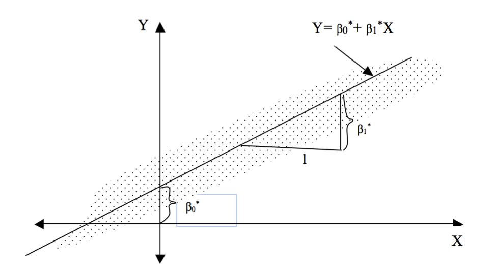
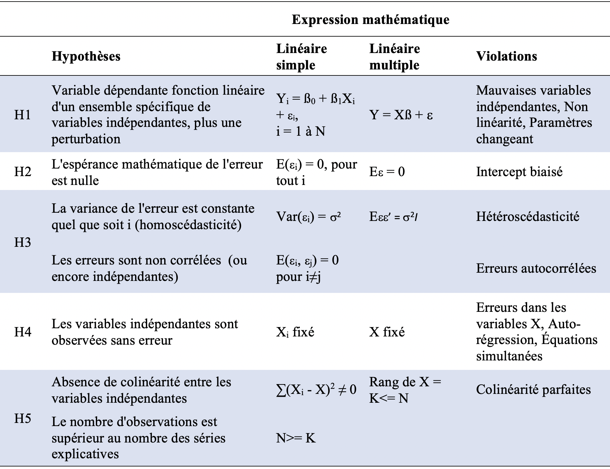

## Plan de présentation

- Exemples graphiques
  - Exemple 1: accès aux médias et attitude face à la violence
  - Exemple 2: Relation entre taille et poids
- Discuter de la meilleure manière d'estimer cette relation
- Présenter le modèle linéaire simple avec ces interprétations


Exemple 1: Ouverture aux médias et attitude face à la violence
========================================================

## Exemple 1: 

Présenter à nouveau la discussion sur la relation entre violence conjugale et l'accès à l'information mesurée par les variables `sec_school` et `no_media`. ouverture aux médias éducation et radio

## Exemple

Nom             Description
---------------  --------------------------------------------------------------
`beat_goesout`   Pourcentage de femmes dans chaque pays qui pensent qu'un mari
                  a le droit de battre sa femme si elle sort sans le lui dire.
`beat_burnfood`  Pourcentage de femmes dans chaque pays qui pensent qu'un mari 
                  a le droit de battre sa femme si elle brûle sa nourriture.  
`no_media`       Pourcentage de femmes dans chaque pays qui ont rarement accès
                  un journal, une radio ou une télévision.
`sec_school`     Pourcentage de femmes dans chaque pays ayant un niveau
                  d'éducation secondaire ou supérieur.
`year`           Année de l'enquête
`region`         Région du monde
`country`        pays
---------------  --------------------------------------------------------------

## Dressons la table

```{r}

rm(list = ls())

library(tidyverse)
dhs_ipv <- read_csv("../Données/dhs_ipv.csv")

```

## Quelques informations sur les données

```{r}

head(dhs_ipv)

```

## Quelques informations sur les données

```{r}

glimpse(dhs_ipv)

```

## Quelques informations sur les données

```{r, size="small"}

summary(dhs_ipv)

```

## Association entre beat_burnfood et niveau d'éducation

```{r, warning=FALSE, message=FALSE, out.height='80%', out.width='60%'}

ggplot(dhs_ipv) +
  geom_point(aes(x = sec_school, y = beat_burnfood), color = "blue") +
  geom_text(aes(x = sec_school, y = beat_burnfood, label = country), size = 2)

```


## Association entre beat-burnfood et niveau d'éducation

```{r, warning=FALSE, message=FALSE, out.height='80%', out.width='60%'}

ggplot(dhs_ipv) +
  geom_point(aes(x = sec_school, y = beat_burnfood)) +
  geom_abline(aes(intercept = 38, slope = -2), color = "red")

```

- Est-ce que c'est la meilleure droite qui indique la relation entre `beat_burnfood` et `sec_school`?
- Pourquoi pas?


## Association entre beat-burnfood et niveau d'éducation


```{r, warning=FALSE, message=FALSE, out.height='80%', out.width='60%'}

ggplot(dhs_ipv) +
  geom_point(aes(x = sec_school, y = beat_burnfood)) +
  geom_abline(aes(intercept = 38, slope = -2), color = "red") +
  geom_abline(aes(intercept = 35, slope = -1.5), color = "green") 


```

- Est-ce plus tôt celle-ci? Pourquoi?


## Association entre beat-burnfood et niveau d'éducation

- Maintenant, simulons un ensemble de droite pour voir si la meilleure candidate figure parmi elles.
- Pour ce faire, je crée 150 intersections (intercept) et 150 pentes (slopes), selon une loi uniforme.
- On parle de loi uniforme quand tous les éléments ont les mêmes probabilités d'être choisis.
(Dire qu'une variable aléatoire X suit une loi uniforme sur l'intervalle [a, b]) signifie que sa densité f est la fonction constante égale à 1/(b-a).

## Association entre beat-burnfood et niveau d'éducation

```{r, warning=FALSE, message=FALSE, out.height='80%', out.width='60%'}

#library(modelr)

set.seed(2001)
models <- tibble(
  a = runif(150, -20, 40),
  b = runif(150, -5, 5)
)
models
```

## Voyons les distributions de a


```{r, warning=FALSE, message=FALSE, out.height='80%', out.width='60%'}

ggplot(models, aes(x = a, y = ..density..)) +
  geom_histogram()

```

## Voyons les distributions de b


```{r, warning=FALSE, message=FALSE, out.height='80%', out.width='60%'}

ggplot(models, aes(x = b, y = ..density..)) +
  geom_histogram()

```


## Association entre beat-burnfood et niveau d'éducation

```{r, warning=FALSE, message=FALSE, out.height='80%', out.width='60%'}

ggplot(dhs_ipv) +
  geom_point(aes(x = sec_school, y = beat_burnfood)) +
  geom_abline(data = models, aes(intercept = a, slope = b), alpha = 1/4)

```

## Association entre beat-burnfood et niveau d'éducation

```{r, warning=FALSE, message=FALSE, out.height='80%', out.width='60%'}

ggplot(dhs_ipv) +
  geom_point(aes(x = sec_school, y = beat_burnfood)) +
  geom_abline(data = models, aes(intercept = a, slope = b, color = b), alpha = 1/4)
  

```

## Association entre beat-burnfood et niveau d'éducation

```{r, warning=FALSE, message=FALSE, out.height='80%', out.width='60%'}

ggplot(dhs_ipv) +
  geom_point(aes(x = sec_school, y = beat_burnfood)) +
  geom_abline(data = models %>% filter(b < 0), aes(intercept = a, slope = b), alpha = 1/4) +
  geom_abline(aes(intercept = 38, slope = -2), color = "red") +
  geom_abline(aes(intercept = 35, slope = -1.5), color = "green")

```

## Association entre beat-burnfood et niveau d'éducation

```{r, warning=FALSE, message=FALSE, warning = FALSE}

graph1 <- ggplot(dhs_ipv) +
  geom_point(aes(x = sec_school, y = beat_burnfood)) +
  geom_abline(data = models %>% filter( b <0 ), aes(intercept = a, slope = b), alpha = 1/4) +
  geom_abline(aes(intercept = 38, slope = -2), color = "red") +
  geom_abline(aes(intercept = 35, slope = -1.5), color = "green") +
  geom_smooth(aes(x = sec_school, y = beat_burnfood), method = "lm", se = FALSE, size = .5)

```


## Association entre beat-burnfood et niveau d'éducation


```{r, warning=FALSE, message=FALSE, warning = FALSE}

graph1

```

## Sur quoi nous basons-nous ou devons-nous nous baser pour choisir cette droite?


Régression linéaire simple
========================================================

## Définition

- Le modèle de **régression linéaire simple** peut être utilisé pour étudier la relation entre deux variables, la variable dépendante (Y) et la variable indépendante (X), comme l'exemple dont nous venons de parler.
- On parle de **régression linéaire multiple** dans le cas où il y a au moins 2 **variables indépendantes**.

## Spécification

- Nous avons {Yi, Xi}, un échantillon de Y et X
- Nous sommes intéressés à **"expliquer Y en termes de X"** ou à **"étudier comment Y varie avec les changements de X"**
- Modèle

$$ Y = \alpha + \beta X + \epsilon $$
 
  - Y = variable dépendante | variable à expliquer
 
  - X = variable indépendante | variable explicative | prédicteur
 
  - ($\alpha$, $\beta$) = coefficients à déterminer (on dit à estimer) | paramètres du modèle
 
  - $\epsilon$ = erreurs| termes d'erreur de moyenne nulle (unobserved error / disturbance error )


## Interprétation

$$ Y = \alpha + \beta X + \epsilon $$
ou une formulation alternative:

$$ E(Y|X) = \alpha + \beta X $$

- $\alpha + \beta X$ : moyenne de Y étant donnée la valeur de X 
- $\alpha$ : la valeur de Y quand X est zéro
- $\beta$ : augmentation de Y associée à une augmentation d'une unité de X

## D'où vient le epsilon

1. Omission de l'influence d'innombrables événements fortuits
    - Autres covariables importantes (influences systématiques)
      Etat nutritionnel de la mère
    - Autres petites variables non significatives avec une très légère influence irrégulière

2. Erreur de mesure
    - Dans la variable dépendante
    - Dans la variable indépendante (plus problématique)

3. Indétermination humaine

    - Le comportement humain est tel que les actions entreprises dans des circonstances identiques différeront de manière aléatoire

## Spécification

```{r rline, echo=FALSE, fig.cap="", out.width = '100%'}

```

- $\beta_{0}$ = intersection à l'origine (intercept)
- $\beta_{1}$ = pente (slope) 


## Méthodes d'estimation

- Il existe de nombreux estimateurs présentant des caractéristiques différentes susceptibles de résoudre l'équation 1. 

- La tâche de l'économètre est de trouver le meilleur **estimateur**. 

- Les deux approches les plus importantes sont:

    1. Méthodes des moindres carrés: dans le cas d'une régression linéaire simple, il s'agit de trouver la meilleure ligne qui décrit de manière appropriée le nuage de points {Yi, Xi}.

    2. Approche du maximum de vraisemblance

<!--
## Méthodes des moindres carrées ordinaires: Hypothèses

numéro    | Hypothèses            | Formules               | Violations
----------:-----------------------:------------------------:-------------
1         |Y est une fonction linéaire  | $$Y = \alpha + \beta X + \epsilon$$ | Mauvais régresseurs
          |d'un X, plus une perturbation    |        |Non-linéarité
          |                                 |        |Changer les paramètres
-->

## Méthodes d'estimation

- Estimer les paramètres du modèle à partir des données {$X_i, Y_i$}
- ($\hat{\alpha}, \hat{\beta}$) : Coefficients estimés
- $\hat{Y} = \hat{\alpha} +  \hat{\beta} X$ : Valeur prédite (predicted/fitted value)
- $\hat{\
epsilon} = Y - \hat{Y}$ : Résidus (residuals)

## Méthode d'estimation: moindres carrées ordinaires

- Minimiser la somme des carrées des résidus (SSR) : $$ SSR = \sum_{i=1}^n\hat{\epsilon}^2  = \sum_{i=1}^n(Y_i - \hat{\alpha} +  \hat{\beta X_i})^2 $$
- Solution
- Coefficients estimés : $$\hat{\alpha} = \bar{Y} -  \hat{\beta} \bar{X}$$

$$\hat{\beta} = \frac{\sum_{i=1}^n(Y_i - \bar{Y})(X_i - \bar{X})}{\sum_{i=1}^n(X_i - \bar{X})^2}$$

- la droite des moindres carrées passe toujours par les points ($\bar{X}, \bar{Y}$)
- $\hat{Y} = \bar{Y}$
- la moyenne des résidus est toujours égale à zéro


Régression linéaire multiple
========================================================


## Introduction

- La régression linéaire simple ne permet pas de déduire une causalité: la réalité est plus complexe
- Permet de comprendre le concept de régression
- En cas de plus d'une variable indépendante, on parle de régression linéaire multiple

## Spécification

$$ Y_i = \alpha + \beta_1 X_{1i} +  \beta_2 X_{2i} + ...+\beta_k X_{ki} +\epsilon_i$$
Où $\epsilon_i$ suit une loi normale de moyenne 0 et de variance $\sigma^2$. On a k indépendantes variables pour n observations ${(Y_i, X_{11}, X_{12}, ..., X_{1k}), ..., (Y_n, X_{n1}, X_{n2}, ..., X_{nk})}$.

Exemple:
  - Y peut être le poids à la naissance
  - X1 l'age de la mère à la naissance de l'enfant
  - X2 le sexe de l'enfant

## Spécification

$$ Y_i = \alpha + \beta_1 X_{1i} +  \beta_2 X_{2i} + ...+\beta_k X_{ki} +\epsilon_i$$

- Votre tâche: estimer l’effet de chaque variable X spécifique sur Y, en contrôlant l’effet des autres.
- Cette équation peut être récrite :

$Y_1 = \alpha + \beta_1 X_{11} + \beta_2 X_{21} + ... + \beta_k X_{k1} + \epsilon_1$
$Y_2 = \alpha + \beta_1 X_{12} + \beta_2 X_{22} + ... + \beta_k X_{k2} + \epsilon_2$
...
$Y_n = \alpha + \beta_1 X_{1n} + \beta_2 X_{2n} + ... + \beta_k X_{kn} + \epsilon_n$

Cette façon d’écrire les équations est difficile à manipuler:

Notation matricielle: $Y = X\beta + \epsilon$

## Spécification


Estimation des paramètres
======================================================

## Hypothèses


```{r, out.width="80%"}

```

## Estimation des paramètres

- Les paramètres inconnus:
  - k (beta) + 1 (alpha) paramètres
  - $\sigma^2$

- Estimation par les moindres carrés ordinaires ou la méthode des maximums de vraisemblance: Plus difficile à estimer.


## Estimation

- On démontre que :

$\beta^* = (X^{'}X)^{-1}(X^{'}Y)$

Variance-covariance de $\beta^* = \sigma^2(X^{'}X)^{-1}$

Mais encore une fois, $\sigma^2$ n'est pas connu. Il est remplacé par:

$s^2 = e^{'}e/(T-k)$

avec (e = Y-Y')


Estimation avec R
========================================================

## Estimation sous R: forme générale

**lm**(**formula**, **data**, subset, weights, na.action,
   method = "qr", model = TRUE, x = FALSE, y = FALSE, qr = TRUE,
   singular.ok = TRUE, contrasts = NULL, offset, ...)
   
- lm : pour dire que vous estimez un modèle linéaire. A l'intérieur, vous devez spécifier :

1. Formula: elle comprend trois éléments :
  - la variable dépendante: le premier élément dans la parenthèse. Il doit s'agir d'une variable qui est continue.
  - le tilde (~) qui sépare la variable dépendante des variables indépendantes
  - les éléments après le ~, ce sont les variables indépendantes. Elles doivent être séparées par des +.

## Estimation sous R: forme générale

2. Data: Vous devez ensuite spécifier les données sur lesquelles vous faites votre régression.

Ces deux éléments sont les plus importants: ils sont obligatoires.

## Estimation sous R: forme générale

```{r}
?lm()
```


Labo
============================================================

## Interprétation des résultats

- Variables continues
- Variables dichotomiques
- Variables catégorielles


