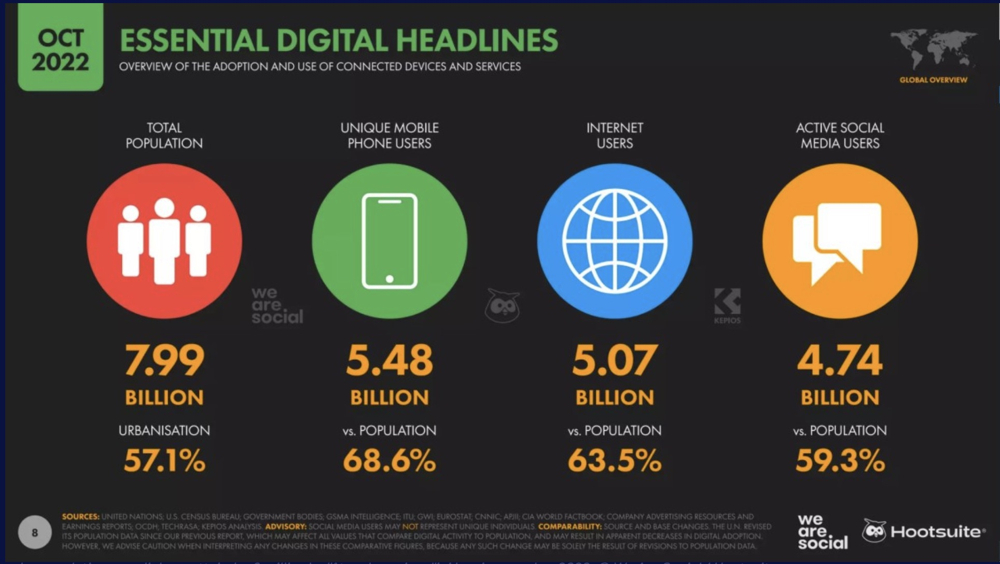

## Plan de présentation

- Données digitales
- Forces et faiblesses des données digitales


## Introduction - questions de recherche

"Combien une nation doit-elle dépenser pour la science ? Quel type de science ? Combien par le secteur privé et combien par le secteur public ? La demande de financement de la part d'exécutants scientifiques potentiels implique-t-elle un manque de financement ou une surabondance d'exécutants ? Ces questions de politique scientifique et d'autres questions connexes ont tendance à être posées et répondues aujourd'hui dans un contexte de plaidoyer très visible qui pose des hypothèses qui méritent d'être examinées de plus près. Une nouvelle "science de la politique scientifique" est en train d'émerger, et elle pourrait offrir des orientations plus convaincantes pour les décisions politiques et pour un plaidoyer plus crédible ..."

## Introduction - questions de recherche

"Relier la R&D à l'innovation de manière générale est une tâche difficile, mais pas désespérée. Nous avons besoin de modèles économétriques qui englobent suffisamment de variables dans un nombre suffisant de pays pour produire des simulations raisonnables de l'effet de choix politiques spécifiques. Ce besoin ne sera pas satisfait par de nouvelles subventions ou de nouveaux ateliers, mais exige l'attention d'une communauté d'érudits spécialisés. Au fur et à mesure que davantage d'économistes et de spécialistes des sciences sociales se tourneront vers ces questions, l'efficacité de la politique scientifique augmentera, ainsi que celle de la défense des sciences" (Marburger, 2005, cité par Foster et al, 2017). 


## Introduction - questions de recherche


```{r, warning=FALSE, message=FALSE, out.width='80%', echo=FALSE}

knitr::include_graphics("../Images/science_policy.jpg")

```

Données digitales
======================================================

## Introduction

- La dernière décennie a été témoin d’une quantité de plus en plus volumineuse de données numériques produites sur Internet qui décrivent le comportement humain et d’autres objets d’investigation scientifique. 
- A cela s'ajoutent des volumes de numérisation de texte,
- et des données administratives de plus en plus volumineuses et accessibles

## Introduction

- Comme le montre la figure ci-dessous, les dernières décennies ont non seulement vu une augmentation de la quantité de données textuelles, mais également une augmentation de la puissance de calcul qui est de plus en plus nécessaire pour l’analyser. 

```{r, warning=FALSE, message=FALSE, out.width='80%', echo=FALSE}

knitr::include_graphics("../Images/Matthews.png")

```


- Ensemble, ces deux évolutions pourraient potentiellement élargir considérablement le champ de la recherche dans de nombreux domaines.

## Qu'est-ce que les données de traces numériques ou digitales?


"Tout comme l’invention du télescope a révolutionné l’étude du ciel, de même qu’en rendant l'immesurable mesurable, la révolution technologique dans les communications mobiles, sur le Web et sur Internet pourrait révolutionner notre compréhension de nous-mêmes et de nos interactions... Trois cents ans après qu'Alexandre Pope ait fait valoir que l'étude appropriée de l'humanité ne devrait pas se trouver dans les cieux mais en nous-mêmes, nous avons enfin trouvé notre télescope. Que la révolution commence."

— Duncan Watts (2011, p. 266)


## Qu'est-ce que les données de traces numériques ou digitales?


[J]ust as the invention of the telescope revolutionized the study of the heavens, so too by rendering the unmeasurable measurable, the technological revolution in mobile, Web, and Internet communications has the potential to revolutionize our understanding of ourselves and how we interact … . [T]hree hundred years after Alexander Pope argued that the proper study of mankind should lie not in the heavens but in ourselves, we have finally found our telescope. Let the revolution begin.

— Duncan Watts (2011, p. 266)

## Qu'est-ce que les données de traces numériques ou digitales?

"... Les chercheurs peuvent maintenant observer le comportement, poser des questions, mener des expériences et collaborer de manière tout à fait impossible dans un passé récent. Ces nouvelles opportunités s'accompagnent de nouveaux risques: les chercheurs peuvent maintenant nuire aux gens d'une manière qui était impossible dans un passé récent."

- (Salganik, 2017)


## Qu'est-ce que les données de traces numériques ou digitales?

1. Données en ligne créées et collectées par les entreprises

- Sites de média sociaux
- Données de recherche Web
- Blogs / Autres forums Internet
- Internet Archive
- Données audio-visuelles

## Qu'est-ce que les données de traces numériques ou digitales?

2. Données des appareils numériques dans le monde physique
    - données de caisse de supermarché ((Mas and Moretti 2009) )
    - Données de téléphonie mobile (Blumenstock, Cadamuro and On, 2015)
    
## Qu'est-ce que les données de traces numériques ou digitales?

3. Données créées par les gouvernements    
    - Données administratives sur les sites Web: dossiers fiscaux, les dossiers scolaires et les dossiers de l'état civil
    - Numérisation de textes historiques / archives
    
    - Exemple: 
        - données des compteurs de taxis numériques du gouvernement de la ville de New York (Farber 2015)
        - dossiers de vote recueillis par le gouvernement ont été utilisés dans une enquête (Ansolabehere and Hersh 2012) et d'une expérience (Bond et al. 2012)


## Quelques chiffres

```{r, warning=FALSE, message=FALSE, out.width='80%', echo=FALSE}



```

## Quelques chiffres

- 171 millions de nouveaux internautes sur les 12 derniers mois (+3,5 %)
- 190 millions de nouveaux utilisateurs des réseaux sociaux au cours des 12 derniers mois (+4,2 %)
- 96,1 % des internautes utilisent leur mobile pour surfer sur le web (+0,3 %),
- 6h37 passées en moyenne sur Internet par jour (en recul de 20 minutes),
- 2h28 passées en moyenne sur les réseaux sociaux par jour (+1 minute),
- 7,2 plateformes utilisées en moyenne par les socionautes chaque mois.

(Source: https://www.blogdumoderateur.com/chiffres-cles-internet-reseaux-sociaux-monde-octobre-2022/)


Caractéristiques des données digitales
======================================================

## Caractéristiques

1. Bon pour la recherche: 

- Volumineuse
- Toujours active
- Non réactive
- Capture les relations sociales

## Caractéristiques

2. Probématique pour la recherche

- Incomplète
- Inaccessible
- Non représentative
- Dérivante
- Algorithmiquement confondue
- Sale
- Sensible

## 1. Volumineuses

- Elles sont volumineuses

"[Notre] corpus contient plus de 500 milliards de mots, en anglais (361 milliards), français (45 milliards), espagnol (45 milliards), allemand (37 milliards), chinois (13 milliards), russe (35 milliards) et hébreu (2 milliards). Les œuvres les plus anciennes ont été publiées dans les années 1500. Les premières décennies ne sont représentées que par quelques livres par an, comprenant plusieurs centaines de milliers de mots. En 1800, le corpus atteint 98 millions de mots par an; en 1900, 1,8 milliard; et en 2000, 11 milliards. Le corpus ne peut pas être lu par un humain. Si vous avez essayé de lire seulement les entrées en anglais de l'an 2000 seulement, au rythme raisonnable de 200 mots / min, sans interruptions pour la nourriture ou le sommeil, cela prendrait 80 ans. La séquence de lettres est 1000 fois plus longue que le génome humain: si vous l'écrivez en ligne droite, elle atteindrait la Lune 10 fois plus vite. " (Michel et al. 2011)

<!--L'ampleur de ces données est sans aucun doute impressionnante, et nous sommes tous chanceux que l'équipe de Google Livres ait diffusé ces données au public (en fait, certaines des activités à la fin de ce chapitre utilisent ces données). Mais, chaque fois que vous voyez quelque chose comme ça, vous devriez demander: est-ce que toutes ces données font vraiment quelque chose? Auraient-ils pu faire la même recherche si les données pouvaient atteindre la Lune et revenir une seule fois? Et si les données pouvaient seulement atteindre le sommet du Mont Everest ou le sommet de la Tour Eiffel?
-->


## 1. Volumineuses

- Pourquoi est-ce important?

  - Étude des phénomènes rares
  
  >- Hétérogénéité: études de Raj Chetty et ses collègues sur la mobilité sociale.            - Utilisation des données fiscales de 40 millions de personnes pour estimer l'hétérogénéité de la mobilité intergénérationnelle entre les régions des États-Unis 

<!--Si Chetty et ses collègues avaient utilisé les dossiers fiscaux de 40 mille personnes plutôt que 40 millions, ils n'auraient pas été en mesure d'estimer l'hétérogénéité régionale et ils n'auraient jamais pu faire des recherches ultérieures pour essayer d'identifier les mécanismes qui créent cette variation.-->
  
  >- Détecter des petites différences: Par exemple, s'il y a deux interventions de santé publique et que l'une est légèrement plus efficace que l'autre, choisir une intervention plus efficace pourrait permettre de sauver des milliers de vies supplémentaires.
  
  >- Faire de la randomisation (expérience dans les magasins en ligne par exemple)


##  2. Continues

- L'une des caractéristiques les plus attrayantes des données de traces numériques est leur collecte continue, contrairement aux enquêtes qui ne fournissent généralement qu'un bref instantané du monde social.
- Permet d'étudier des évènements inattendus
- Exemple: Ceren Budak et Duncan Watts (2015) dans l'étude sur les manifestations en Turquie: ils ont été en mesure d'estimer quels types de personnes étaient plus susceptibles de participer aux manifestations de Gezi et d'estimer les changements d'attitudes de participants et non-participants, à la fois à court terme (comparant les pré-Gezi à Gezi) et à long terme (comparant les pré-Gezi aux post-Gezi).


##  2. Continues

```{r, warning=FALSE, message=FALSE, out.width='80%', echo=FALSE}

knitr::include_graphics("../Images/c10continue.png")

```


<!--
Figure 2.2: Conception utilisée par Budak and Watts (2015) pour étudier les manifestations d'Occupy Gezi en Turquie à l'été 2013. En utilisant la nature permanente de Twitter, les chercheurs ont créé ce qu'ils ont appelé un panel ex-post qui comprenait environ 30 000 personnes sur deux ans. Contrairement à une étude typique centrée sur les participants pendant les manifestations, le panel ex-post ajoute 1) les données des participants avant et après l'événement et 2) les données des non-participants avant, pendant et après l'événement. Cette structure de données enrichie a permis à Budak et Watts d'estimer les types de personnes les plus susceptibles de participer aux manifestations de Gezi et d'estimer les changements d'attitudes des participants et des non-participants, à court terme (comparaison avec Gezi avant Gezi). ) et à long terme (comparaison de pré-Gezi avec post-Gezi)

-->

##  2. Continues

```{r, warning=FALSE, message=FALSE, out.width='80%', echo=FALSE}

knitr::include_graphics("../Images/c10continue2.png")

```


<!--
En plus d'étudier des événements inattendus, les systèmes de données volumineuses permettent également aux chercheurs de produire des estimations en temps réel, ce qui peut être important dans les contextes où les décideurs - au gouvernement ou dans l'industrie - veulent réagir en fonction de la situation. Par exemple, les données des médias sociaux peuvent être utilisées pour orienter les interventions d'urgence en cas de catastrophes naturelles (Castillo 2016) et diverses sources de données volumineuses peuvent être utilisées pour produire des estimations en temps réel de l'activité économique (Choi and Varian 2012) .
-->


## 3. Non réactives

- Un autre avantage important des données de traces numériques est qu'elles sont non réactives ou ne sont pas produites via une interaction entre les chercheurs et ceux qu'ils étudient. 

- Dans certains cas, cela peut entraîner une réduction significative du biais de désirabilité sociale ou d'autres formes d'effet de l'intervieweur. 

- Exemple : Stephens-Davidowitz (2014) utilisé la prévalence des termes racistes dans les requêtes des moteurs de recherche pour mesurer l'animosité raciale dans différentes régions des États-Unis

- Considérons, par exemple, l’utilisation des données de recherche Google pour étudier l’avortement volontaire (voir la figure ci-dessous).

<!-- Un aspect des données volumineuses que de nombreux chercheurs trouvent prometteur est que les participants ne sont généralement pas conscients que leurs données sont capturées ou qu'ils se sont tellement habitués à cette collecte de données qu'il ne change plus leur comportement. -->

## 3. Non réactives

```{r, warning=FALSE, message=FALSE, out.width='80%', echo=FALSE}

knitr::include_graphics("../Images/c10reactive.png")

```

## 3. Non réactives

- Ne reflète pas d'une manière ou d'une autre le comportement ou les attitudes des gens : «ce n'est pas que je n'ai pas de problèmes, je ne les mets tout simplement pas sur Facebook» (Newman et al. 2011). 

- Les gens ont tendance à se présenter de la meilleure manière possible. 

- Affecté par les objectifs des objectifs des propriétaires de plate-forme

- Enfin, bien que la non-réactivité soit avantageuse pour la recherche, le suivi du comportement des personnes sans leur consentement et leur sensibilisation soulève des préoccupations éthiques.


## 4. Capture les relations sociales

- Les données de traces numériques sont également quelque peu inhabituelles dans la mesure où elles décrivent souvent des relations sociales. 

- Alors que les techniques d'enquête classiques ne mesurent généralement que les caractéristiques de sujets individuels, par exemple, les données de trace numériques peuvent souvent être utilisées pour mesurer des relations sociales telles que le réseau de politiciens européens illustré ci-dessous.

## 4. Capture les relations sociales

```{r, warning=FALSE, message=FALSE, out.width='80%', echo=FALSE}

knitr::include_graphics("../Images/c10relation.png")

```


## 5. Incomplètes

- Bien que la taille et l’échelle des données de traces numériques pouvant être collectées soient souvent considérées comme un gage, les nouveaux arrivants sur le terrain sont souvent surpris par la quantité de données qui manque souvent ou est incomplète. 

- **Incomplète naturellement**: La plupart des grandes sources de données sont incomplètes, dans le sens où elles ne disposent pas de l'information que vous voulez pour votre recherche. Elles manquent trois types d'information:

    - les informations démographiques sur les participants, 
    - le comportement sur d'autres plateformes et 
    - les données permettant d'opérationnaliser les concepts théoriques: comment mesurer par exemple l'intéligence à partir de ces données? 

<!-- De nombreux chercheurs en sciences sociales ont déjà eu l'expérience de traiter l'incomplétude, comme une enquête existante qui ne posait pas la question qui était nécessaire. Malheureusement, les problèmes d'incomplétude ont tendance à être plus extrêmes dans les grandes données. 

Lorsque vous évaluez un résultat de recherche, un moyen rapide et utile d'évaluer la validité du construit est de prendre le résultat, qui est généralement exprimé en termes de constructions, et de le ré-exprimer en termes de données utilisées. Par exemple, considérons deux études hypothétiques qui prétendent montrer que les gens qui sont plus intelligents gagnent plus d'argent. Dans la première étude, le chercheur a constaté que les personnes qui obtiennent de bons résultats au Raven Progressive Matrices Test - un test d'intelligence analytique bien étudié (Carpenter, Just, and Shell 1990) - ont des revenus déclarés plus élevés dans leurs déclarations de revenus. Dans la deuxième étude, le chercheur a constaté que les personnes sur Twitter qui utilisent des mots plus longs sont plus susceptibles de mentionner les marques de luxe. Dans les deux cas, ces chercheurs pourraient prétendre avoir démontré que les personnes plus intelligentes gagnent plus d'argent. Cependant, dans la première étude, les constructions théoriques sont bien opérationnalisées par les données, alors que dans la seconde, elles ne le sont pas. En outre, comme cet exemple l'illustre, plus de données ne résolvent pas automatiquement les problèmes de validité de construction. Vous devriez douter des résultats de la deuxième étude, qu'il s'agisse d'un million de tweets, d'un milliard de tweets ou d'un billion de tweets.
-->


>- **Incomplète par suppression**: prenons, par exemple, une étude sur les comportements d'intimidation sur les réseaux sociaux: bon nombre des publications les plus abusives susceptibles d'intéresser un chercheur sont souvent supprimées par Facebook avant que l'on puisse tenter de les étudier.

## 6. Inaccessibles

- Un défi encore plus redoutable est que les données sont souvent inaccessibles. Bien que Twitter fournisse une quantité énorme de données accessibles au public, la grande majorité des données générées sur Facebook sont privées. 

- Bien que certaines pages Facebook telles que les "pages de fans" aient des paramètres publics par défaut, la grande majorité des utilisateurs de Facebook définissent leurs paramètres de confidentialité par défaut de manière à ce que les utilisateurs ne puissent accéder à leurs données que s'ils sont affiliés les uns aux autres en tant qu' "amis".

<!-- Selon mon expérience, de nombreux chercheurs basés dans les universités comprennent mal la source de cette inaccessibilité. Ces données sont inaccessibles non pas parce que les gens dans les entreprises et les gouvernements sont stupides, paresseux ou indifférents. Il existe plutôt de sérieux obstacles juridiques, commerciaux et éthiques qui empêchent l'accès aux données. Par exemple, certains accords sur les conditions d'utilisation des sites Web autorisent uniquement l'utilisation de données par les employés ou l'amélioration du service. Ainsi, certaines formes de partage de données pourraient exposer les entreprises à des poursuites légitimes des clients. Il existe également des risques commerciaux importants pour les entreprises impliquées dans le partage de données. Essayez d'imaginer comment le public réagirait si des données de recherche personnelles étaient divulguées accidentellement par Google dans le cadre d'un projet de recherche universitaire. Une telle violation de données, si extrême, pourrait même être un risque existentiel pour l'entreprise. Donc Google - et la plupart des grandes entreprises - sont très réticents au risque de partager des données avec les chercheurs.-->

## 7. Non-représentatives

- Ceux qui souhaitent utiliser des données de traces numériques doivent également faire face à un autre défi majeur: un échantillon aléatoire d'utilisateurs de Facebook ou de Twitter n'est pas représentatif de la population plus large des États-Unis ou de la plupart des autres pays. 
- Les données du Wall Street Journal sur les données démographiques des utilisateurs de plusieurs sites de médias sociaux démontrent des différences significatives entre plates-formes en fonction de la race. 
- D'autre part, l'utilisation de Facebook est devenue tellement répandue que certains lecteurs pourraient être surpris de voir à quel point il est devenu plus représentatif du public américain au cours des dernières années.

## 7. Non-représentatives

- Faire la différence entre transportabilité (comparaison intra-échantillon) 

    - Étude de John Snow sur l'épidémie de choléra de 1853-54 à Londres
    - Étude de Richard Doll et A. Bradford Hill (1954) qui ont suivi environ 25 000 hommes médecins pendant plusieurs années et ont comparé leurs taux de mortalité en fonction du nombre de cigarettes fumé. Ce résultat est transportable sur d'autres populations, pas à cause de la représentativité, mais du mécanisme liant tabac et cancer
    
- Et représentativité (généralisation -- problème statistique)


<!-- En conclusion, de nombreuses sources de données importantes ne sont pas des échantillons représentatifs d'une population bien définie. Pour les questions qui nécessitent de généraliser les résultats de l'échantillon à la population à partir de laquelle il a été tiré, c'est un problème sérieux. Mais pour des questions sur les comparaisons intra-échantillon, les données non représentatives peuvent être puissantes, à condition que les chercheurs soient clairs sur les caractéristiques de leur échantillon et soutiennent les affirmations sur la transportabilité avec des preuves théoriques ou empiriques. En fait, j'espère que les sources de données volumineuses permettront aux chercheurs d'effectuer davantage de comparaisons intra-échantillon dans de nombreux groupes non représentatifs, et je suppose que les estimations de plusieurs groupes feront davantage avancer la recherche sociale qu'une simple estimation aléatoire aléatoire. échantillon.-->

## 8. Dérive (Drift)

- Selon certains analystes, MySpace était autrefois le plus grand site de média social au monde. C’est maintenant qu’il réside dans le cimetière de l’histoire d’Internet, comme tant d’autres sites. Cela augmente le risque de «dérive» dans les données de traces numériques.
- Les plateformes numériques ne changent pas seulement de popularité (ce qui a bien sûr des implications importantes pour leur représentativité), mais aussi selon qui les utilise et pourquoi. 
- Bien que Facebook fût autrefois la plateforme la plus populaire pour les étudiants américains de premier cycle, beaucoup d’entre eux se sont tournés vers Instagram ou Snapchat, peut-être en réaction à la hausse de l’utilisation de Facebook par la génération de leurs parents :)


## 8. Dérive (Drift)

- Trois types de dérive:

    1. dérivée-est causée par des changements dans l'utilisation du système
    2. changements dans la façon dont le système est utilisé
    3. dérive est la dérive du système
    
<!--En conclusion, de nombreuses sources de données volumineuses sont en train de dériver en raison des changements dans la façon de les utiliser, dans la façon dont elles sont utilisées et dans le fonctionnement des systèmes. Ces sources de changement sont parfois des questions de recherche intéressantes, mais ces changements compliquent la capacité des grandes sources de données à suivre les changements à long terme au fil du temps.-->

## 9. Algorithmiquement confondant

- Parfois, les données de traces numériques qui semblent décrire le comportement humain reflètent en réalité des changements dans la façon dont les humains interagissent avec des algorithmes. 

- Un exemple relativement simple de confusion algorithmique est le fait que sur Facebook, il y a un nombre anormalement élevé d'utilisateurs avec environ 20 amis, comme l'ont découvert Johan Ugander et ses collègues (2011)

- La «parabole de Google Flu» en est un exemple populaire. À l'origine, Google Flu était un outil populaire permettant aux utilisateurs d'estimer la prévalence de la grippe à l'aide des données de recherche Google. 
- L'outil était si précis que certains ont suggéré de déplacer les enquêtes officielles des Centers for Disease Control (CDC). 

## 9. Algorithmiquement confondant

- Au début de 2013, les estimations de Google étaient bien supérieures à celles de la CDC. 
- Des chercheurs ont par la suite découvert que les liens hypertextes liés à la grippe sur laquelle les internautes avaient cliqué apparaissaient dans leur navigateur Web après avoir recherché des informations sur les symptômes du rhume. 

- Contrairement à d'autres problèmes avec les traces numériques, la confusion algorithmique est largement invisible

## 9. Algorithmiquement confondant

"Plutôt que de penser aux grandes sources de données comme observant les gens dans un cadre naturel, une métaphore plus appropriée est d'observer les gens dans un casino. Les casinos sont des environnements hautement conçus conçus pour induire certains comportements, et un chercheur ne s'attendrait jamais à ce que le comportement dans un casino fournisse une fenêtre ouverte sur le comportement humain. Bien sûr, vous pourriez apprendre quelque chose sur le comportement humain en étudiant les gens dans les casinos, mais si vous ignorez le fait que les données ont été créées dans un casino, vous pourriez tirer de mauvaises conclusions." (Salganik, 2017)

<!--Malheureusement, il est particulièrement difficile de traiter la confusion algorithmique car de nombreuses fonctionnalités des systèmes en ligne sont propriétaires, mal documentées et en constante évolution. Par exemple, comme je l'expliquerai plus loin dans ce chapitre, la confusion algorithmique était une explication possible de la dégradation progressive de Google Flu Trends (section 2.4.2), mais cette affirmation était difficile à évaluer car les mécanismes internes de l'algorithme de recherche de Google propriétaire. La nature dynamique de la confusion algorithmique est une forme de dérive du système. La confusion algorithmique signifie que nous devons être prudents quant à toute affirmation concernant le comportement humain provenant d'un système numérique unique, quelle que soit sa taille.-->


## 10. Non-structurées

- Les données de traces numériques sont également souvent très désordonnées. 
- Les nouveaux venus sur le terrain pensent souvent que les données générées sous forme numérique sont bien structurées, faciles à rechercher et rapidement transposables dans différents formats. 
- Comme nous le verrons dans les prochains tutoriels, ce n'est généralement pas vrai. 
- Un article récent du New York Times indiquait que les scientifiques du traitement des données consacraient plus de 80% de leur temps à nettoyer les données!

<!-- Je pense que la source ultime de cette difficulté est que bon nombre de ces sources de données volumineuses n'ont jamais été utilisées à des fins de recherche et qu'elles ne sont donc pas collectées, stockées et documentées de manière à faciliter le nettoyage des données.

Comme l'illustre cet exemple, une analyse relativement simple de données relativement complexes et en désordre risque d'être sérieusement faussée.

Il n'y a pas de technique ou d'approche statistique unique qui puisse garantir que vous avez suffisamment nettoyé vos données sales. En fin de compte, je pense que la meilleure façon d'éviter d'être berné par des données sales est de comprendre autant que possible la façon dont vos données ont été créées.
-->

## 11. Sensibles

- Les données de traces numériques sont également souvent très sensibles. 
- Les récents événements impliquant Facebook et le cabinet de conseil politique Cambridge Analytica soulignent les dangers d'un accès illimité à de grandes quantités de données de traces numériques, mais il y avait beaucoup plus de violations de données, peut-être plus invasives, bien avant cet événement récent. 
- Un de ces incidents, illustré ci-dessous, impliquait des chercheurs européens qui avaient extrait des données du site de rencontres Internet OK Cupid, puis avaient rendu publiques leurs données en ligne.

## 12. Biais positif

- Enfin, les données de traces numériques ont souvent des dimensions performatives. 
- De nombreuses personnes ne signalent pas d'informations négatives à leur sujet en ligne précisément parce qu'elles savent que leurs amis, leurs collègues ou d'autres personnes qu'elles ne connaissent pas peuvent les surveiller. 
- Cela crée une autre forme commune de biais dans la recherche sur les médias sociaux.


Les stratégies de recherche
=======================================

## Les stratégies de recherche:

1. Compter les choses 
2. Prédirer les choses et 
3. Approximer les expériences

## Compter les choses

"Souvent, les étudiants motivent leur recherche en disant: Je vais compter quelque chose que personne n'a jamais compté auparavant. Par exemple, un étudiant pourrait dire que beaucoup de gens ont étudié des migrants et beaucoup de gens ont étudié des jumeaux, mais personne n'a étudié les jumeaux migrants. D'après mon expérience, cette stratégie, que j'appelle la motivation par l'absence , ne mène généralement pas à de bonnes recherches. La motivation par l'absence est un peu comme dire qu'il y a un trou là-bas, et je vais travailler très dur pour le remplir. Mais pas tous les trous doivent être remplis." (Salganik, 2017)

- Rechercher plutôt des questions de recherche qui sont :
    - Importantes: a un impact mesurable ou qu'elle alimente une décision importante des décideurs
    - ou Intéressantes: Étude de Henry Farber (2015) sur le comportement des chauffeurs de taxis de New York

## Compter les choses

Intéressantes: Étude de Henry Farber (2015) sur le comportement des chauffeurs de taxis de New York

- Les modèles néoclassiques en économie prédisent que les chauffeurs de taxi travailleront davantage les jours où ils ont des salaires horaires plus élevés.

- Alternativement, les modèles de l'économie comportementale prédisent exactement le contraire. 

- Données utilisées: chaque trajet en taxi effectué par les taxis de New York de 2009 à 2013 

    - Informations sur chaque voyage: heure de départ, lieu de départ, heure de fin, lieu de fin, tarif et pourboire (si le pourboire a été payé avec une carte de crédit)
    
<!-- L'étude de Farber était proche d'un scénario optimiste pour une recherche utilisant une grande source de données car les données collectées par la ville étaient assez proches des données que Farber aurait recueillies (une différence est que Farber aurait voulu des données sur le total les salaires et les pourboires, mais les données sur la ville ne comprennent que les pourboires payés par carte de crédit). Cependant, les données seules n'étaient pas suffisantes. La clé de la recherche de Farber était d'apporter une question intéressante aux données, une question qui a des implications plus larges au-delà de ce cadre spécifique.-->


## Prédire les choses 

- Nowcasting: Étude de Ginsberg et ses collègues sur la grippe (2009)

## Approximer les expériences

- Quel est l'effet d'un programme de formation professionnelle sur les salaires?

- Expérimentation naturelle: augmentation du salaire minimum
- Ajustement statistique


## Les stratégies de recherche: conclusion

"Les données volumineuses sont créées et collectées par les entreprises et les gouvernements à des fins autres que la recherche. L'utilisation de ces données pour la recherche nécessite donc une réutilisation."

Sociologie (sciences sociales), qualité des données, données massives
===========================================================================

## Qualité des données

- Les problèmes sur les données digitales tels que nous venons de le voir ne sont pas limités uniquement à ces données. Ils sont inhérents à toutes les données.
- Par exemple, une enquête très bien réfléchie et exécutée qui comporte beaucoup de données manquantes a les mêmes problèmes dont nous venons de parler.
- Même si la collecte des données est moins coûteuse, le coût pour en faire des données de qualité est exorbitant.

## Qualité des données

La qualité des données peut être caractérisée de différentes manières :
- **Précision**: quelle est la précision des valeurs d'attribut dans les données?
- **Exhaustivité**: les données sont-elles complètes?
- **Cohérence**: Dans quelle mesure les valeurs sont-elles cohérentes dans et entre les bases de données?
- **Actualisée**: dans quelle mesure les données sont-elles actualisées?
- **Accessibilité**: toutes les variables sont-elles disponibles pour l'analyse?


## Qualité des données

- Pour avoir des données de qualité, plusieurs étapes sont importantes:
1. Analyse (parsing)
2. Standardisation
3. Dé-duplication
4. Normalisation

## 1. Analyse

- Processus de décomposition d'une variable complexe en ces éléments constitutifs
- Exemple: La variable adresse "1245 Jean-Talon Est" peut être décomposée à:
  - Numéro
  - Nom
  - Direction
  
## 1. Analyse

Les étapes typiques d'une procédure d'analyse comprennent:

- Fractionnement des champs en jetons (mots) sur la base de délimiteurs,

>- Standardisation des jetons par tables de correspondance et substitution par un formulaire standard,
>- Catégorisation des jetons,
>- Identification d'un motif d'ancres, de jetons et de délimiteurs,
>- Appel de sous-programmes selon le modèle identifié, mappage des jetons vers les composants prédéfinis

## 2. Standardisation

- La standardisation fait référence au processus de simplification des données en remplaçant les variantes de représentation de la même observation sous-jacente par une valeur par défaut afin d'améliorer la précision des comparaisons de terrain.

- Exemple: av. et avenue désigne la même manière décrire les adresses.
- Aussi, si vous cherchez tous les avenues dans votre base de données, vous allez manquer celles qui sont écrites avec **av**. 
- La standardisation permet de résoudre ce problème.

## 2. Standardisation

des exemples communs de standardisations sont:

- Standardisation des différentes orthographes de mots fréquemment rencontrés: par exemple, remplacer les abréviations courantes dans les noms de rue (Ave, St, etc.) ou les titres (Ms, Dr, etc.) par une forme commune. Ces types de règles sont très spécifiques aux pays et aux langues.
- Standardisation générale, y compris la conversion des champs de caractères en majuscules et la suppression de la ponctuation et des chiffres

## 3. De-duplication

- La de-duplication consiste à supprimer les enregistrements redondants d'une seule liste, c'est-à-dire plusieurs enregistrements de la même liste qui font référence à la même entité sous-jacente.

## 4. Normalisation


La normalisation consiste à garantir que les champs comparés entre les fichiers sont aussi similaires que possible dans le sens où ils auraient pu être générés par le même processus.

- Par exemple, considérez un champ de salaire dans une enquête. Le salaire peut être enregistré de différentes manières: il peut être tronqué comme mesure de protection de la vie privée ou arrondi au millier le plus proche, et les valeurs manquantes peuvent être imputées avec la moyenne ou avec zéro. Lors de la normalisation, nous notons exactement comment les champs sont enregistrés.


## Conclusion

- Répondre à l'intérogation de départ pour le Canada à partir de ces données:

https://www.sshrc-crsh.gc.ca/results-resultats/recipients-recipiendaires/2022/idg-sds-fra.aspx


## Ressources

1. Données

- https://labs.jstor.org/projects/text-mining/
- https://iris.isr.umich.edu/

2. Méthodes


3. Sites web

- github.com/BigDataSocialScience