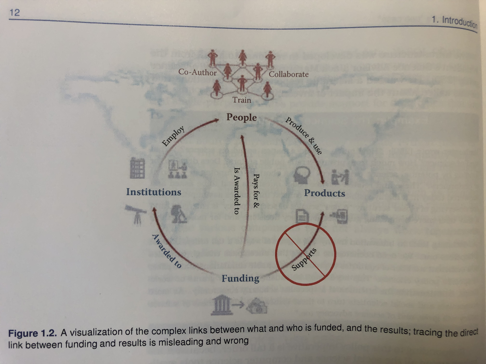
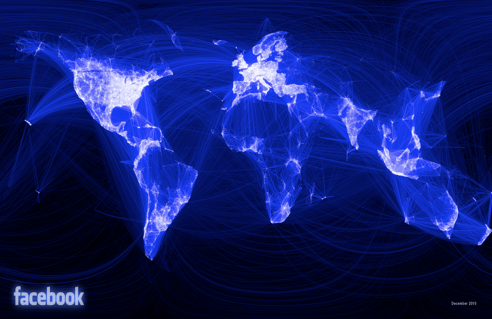
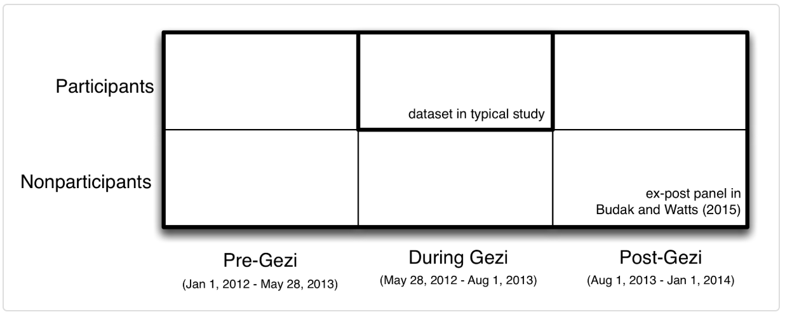
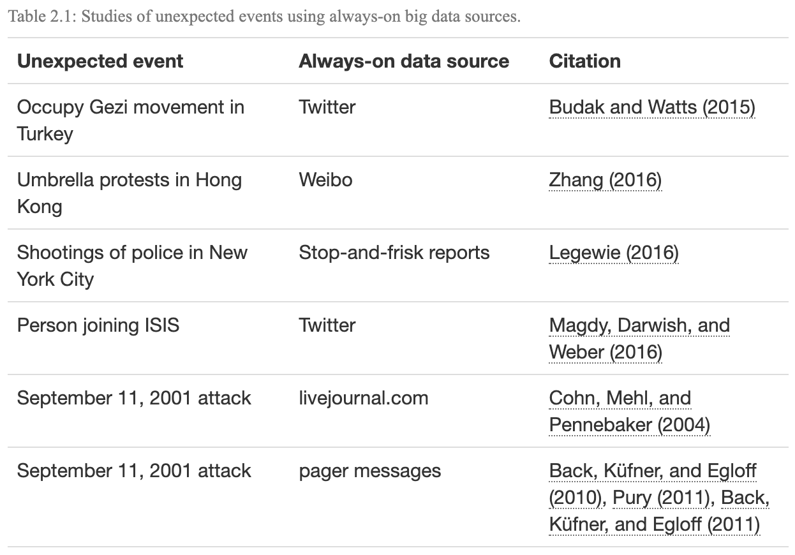
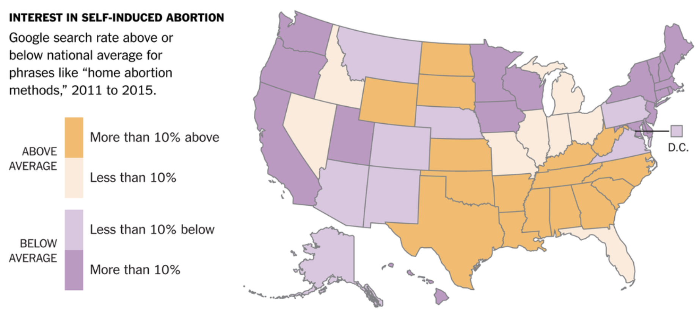
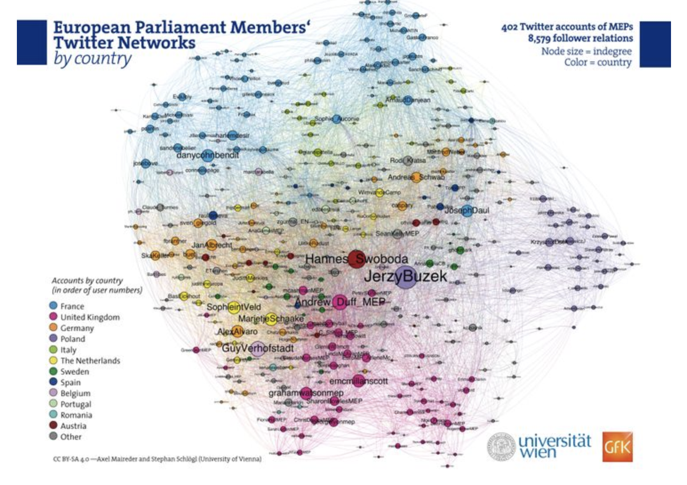

## Plan de présentation

- Données digitales
- Forces et faiblesses des données digitales


## Introduction - questions de recherche

"Combien une nation doit-elle dépenser pour la science ? Quel type de science ? Combien par le secteur privé et combien par le secteur public ? La demande de financement de la part d'exécutants scientifiques potentiels implique-t-elle un manque de financement ou une surabondance d'exécutants ? Ces questions de politique scientifique et d'autres questions connexes ont tendance à être posées et répondues aujourd'hui dans un contexte de plaidoyer très visible qui pose des hypothèses qui méritent d'être examinées de plus près. Une nouvelle "science de la politique scientifique" est en train d'émerger, et elle pourrait offrir des orientations plus convaincantes pour les décisions politiques et pour un plaidoyer plus crédible ..."

## Introduction - questions de recherche

"Relier la R&D à l'innovation de manière générale est une tâche difficile, mais pas désespérée. Nous avons besoin de modèles économétriques qui englobent suffisamment de variables dans un nombre suffisant de pays pour produire des simulations raisonnables de l'effet de choix politiques spécifiques. Ce besoin ne sera pas satisfait par de nouvelles subventions ou de nouveaux ateliers, mais exige l'attention d'une communauté d'érudits spécialisés. Au fur et à mesure que davantage d'économistes et de spécialistes des sciences sociales se tourneront vers ces questions, l'efficacité de la politique scientifique augmentera, ainsi que celle de la défense des sciences" (Marburger, 2005, cité par Foster et al, 2017). 


## Introduction - questions de recherche


```{r, warning=FALSE, message=FALSE, out.width='80%', echo=FALSE}



```


Données digitales
======================================================

## Introduction

- La dernière décennie a été témoin d’une quantité de plus en plus volumineuse de données numériques produites sur Internet qui décrivent le comportement humain et d’autres objets d’investigation scientifique. 
- A cela s'ajoutent des volumes de numérisation de texte,
- et des données administratives de plus en plus volumineuses et accessibles

## Introduction

- Comme le montre la figure ci-dessous, les dernières décennies ont non seulement vu une augmentation de la quantité de données textuelles, mais également une augmentation de la puissance de calcul qui est de plus en plus nécessaire pour l’analyser. 

```{r, warning=FALSE, message=FALSE, out.width='80%', echo=FALSE}

knitr::include_graphics("../Images/Matthews.png")

```


- Ensemble, ces deux évolutions pourraient potentiellement élargir considérablement le champ de la recherche dans de nombreux domaines.

## Qu'est-ce que les données de traces numériques ou digitales?


"Tout comme l’invention du télescope a révolutionné l’étude du ciel, de même qu’en rendant l'immesurable mesurable, la révolution technologique dans les communications mobiles, sur le Web et sur Internet pourrait révolutionner notre compréhension de nous-mêmes et de nos interactions... Trois cents ans après qu'Alexandre Pope ait fait valoir que l'étude appropriée de l'humanité ne devrait pas se trouver dans les cieux mais en nous-mêmes, nous avons enfin trouvé notre télescope. Que la révolution commence."

— Duncan Watts (2011, p. 266)


## Qu'est-ce que les données de traces numériques ou digitales?


[J]ust as the invention of the telescope revolutionized the study of the heavens, so too by rendering the unmeasurable measurable, the technological revolution in mobile, Web, and Internet communications has the potential to revolutionize our understanding of ourselves and how we interact … . [T]hree hundred years after Alexander Pope argued that the proper study of mankind should lie not in the heavens but in ourselves, we have finally found our telescope. Let the revolution begin.

— Duncan Watts (2011, p. 266)

## Qu'est-ce que les données de traces numériques ou digitales?

- Sites de média sociaux
- Données de recherche Web
- Blogs / Autres forums Internet
- Données administratives sur les sites Web
- Internet Archive
- Numérisation de textes historiques / archives
- Données audio-visuelles
- Données de téléphonie mobile

## Exemples

```{r, warning=FALSE, message=FALSE, out.width='80%', echo=FALSE}



```


Caractéristiques des données digitales
======================================================

## 1. Volumineuses

- Elles sont volumineuses
- Pourquoi est-ce important?
  - Étude des phénomènes rares
  - Hétérogénéité: études de Raj Chetty et ses collègues sur la mobilité sociale (que j'ai présenté en introduction de mon cours)
  - Détecter des petites différences

##  2. Continues

- L'une des caractéristiques les plus attrayantes des données de traces numériques est leur collecte continue, contrairement aux enquêtes qui ne fournissent généralement qu'un bref instantané du monde social.
- Permet d'étudier des évènements inattendus
- Exemple: Ceren Budak et Duncan Watts (2015) dans l'étude sur les manifestations en Turquie

##  2. Continues

```{r, warning=FALSE, message=FALSE, out.width='80%', echo=FALSE}



```


<!--
Figure 2.2: Conception utilisée par Budak and Watts (2015) pour étudier les manifestations d'Occupy Gezi en Turquie à l'été 2013. En utilisant la nature permanente de Twitter, les chercheurs ont créé ce qu'ils ont appelé un panel ex-post qui comprenait environ 30 000 personnes sur deux ans. Contrairement à une étude typique centrée sur les participants pendant les manifestations, le panel ex-post ajoute 1) les données des participants avant et après l'événement et 2) les données des non-participants avant, pendant et après l'événement. Cette structure de données enrichie a permis à Budak et Watts d'estimer les types de personnes les plus susceptibles de participer aux manifestations de Gezi et d'estimer les changements d'attitudes des participants et des non-participants, à court terme (comparaison avec Gezi avant Gezi). ) et à long terme (comparaison de pré-Gezi avec post-Gezi)

-->

##  2. Continues

```{r, warning=FALSE, message=FALSE, out.width='80%', echo=FALSE}



```


<!--
En plus d'étudier des événements inattendus, les systèmes de données volumineuses permettent également aux chercheurs de produire des estimations en temps réel, ce qui peut être important dans les contextes où les décideurs - au gouvernement ou dans l'industrie - veulent réagir en fonction de la situation. Par exemple, les données des médias sociaux peuvent être utilisées pour orienter les interventions d'urgence en cas de catastrophes naturelles (Castillo 2016) et diverses sources de données volumineuses peuvent être utilisées pour produire des estimations en temps réel de l'activité économique (Choi and Varian 2012) .
-->


## 3. Non réactives

- Un autre avantage important des données de traces numériques est qu'elles sont non réactives ou ne sont pas produites via une interaction entre les chercheurs et ceux qu'ils étudient. 
- Dans certains cas, cela peut entraîner une réduction significative du biais de désirabilité sociale ou d'autres formes d'effet de l'intervieweur. 
- Considérons, par exemple, l’utilisation des données de recherche Google pour étudier l’avortement volontaire (voir la figure ci-dessous).


## 3. Non réactives

```{r, warning=FALSE, message=FALSE, out.width='80%', echo=FALSE}



```


## 4. Capture les relations sociales

- Les données de traces numériques sont également quelque peu inhabituelles dans la mesure où elles décrivent souvent des relations sociales. 
- Alors que les techniques d'enquête classiques ne mesurent généralement que les caractéristiques de sujets individuels, par exemple, les données de trace numériques peuvent souvent être utilisées pour mesurer des relations sociales telles que le réseau de politiciens européens illustré ci-dessous.

## 4. Capture les relations sociales

```{r, warning=FALSE, message=FALSE, out.width='80%', echo=FALSE}



```


## 5. Incomplètes

- Bien que la taille et l’échelle des données de traçage numériques pouvant être collectées soient souvent considérées comme un gage, les nouveaux arrivants sur le terrain sont souvent surpris par la quantité de données qui manque souvent ou est incomplète. 
- Prenons, par exemple, une étude sur les comportements d'intimidation sur les réseaux sociaux: bon nombre des publications les plus abusives susceptibles d'intéresser un chercheur sont souvent supprimées par Facebook avant que l'on puisse tenter de les étudier.

## 6. Inaccessibles

- Un défi encore plus redoutable est que les données sont souvent inaccessibles. Bien que Twitter fournisse une quantité énorme de données accessibles au public, la grande majorité des données générées sur Facebook sont privées. 
- Bien que certaines pages Facebook telles que les "pages de fans" aient des paramètres publics par défaut, la grande majorité des utilisateurs de Facebook définissent leurs paramètres de confidentialité par défaut de manière à ce que les utilisateurs ne puissent accéder à leurs données que s'ils sont affiliés les uns aux autres en tant qu' "amis".


## 7. Non-représentatives

- Ceux qui souhaitent utiliser des données de traces numériques doivent également faire face à un autre défi majeur: un échantillon aléatoire d'utilisateurs de Facebook ou de Twitter n'est pas représentatif de la population plus large des États-Unis ou de la plupart des autres pays. 
- La figure ci-dessous présente des données du Wall Street Journal sur les données démographiques des utilisateurs de plusieurs sites de médias sociaux, démontrant des différences significatives entre plates-formes en fonction de la race. 
- D'autre part, l'utilisation de Facebook est devenue tellement répandue que certains lecteurs pourraient être surpris de voir à quel point il est devenu plus représentatif du public américain au cours des dernières années.

## 8. Dérive (Drift)

- Selon certains analystes, MySpace était autrefois le plus grand site de média social au monde. C’est maintenant qu’il réside dans le cimetière de l’histoire d’Internet, comme tant d’autres sites. Cela augmente le risque de «dérive» dans les données de traces numériques.
- Les plateformes numériques ne changent pas seulement de popularité (ce qui a bien sûr des implications importantes pour leur représentativité), mais aussi selon qui les utilise et pourquoi. 
- Bien que Facebook fût autrefois la plateforme la plus populaire pour les étudiants américains de premier cycle, beaucoup d’entre eux se sont tournés vers Instagram ou Snapchat, peut-être en réaction à la hausse de l’utilisation de Facebook par la génération de leurs parents :)

## 9. Algorithmiquement confondant

- Parfois, les données de traces numériques qui semblent décrire le comportement humain reflètent en réalité des changements dans la façon dont les humains interagissent avec des algorithmes. 
- La «parabole de Google Flu» en est un exemple populaire. À l'origine, Google Flu était un outil populaire permettant aux utilisateurs d'estimer la prévalence de la grippe à l'aide des données de recherche Google. 
- L'outil était si précis que certains ont suggéré de déplacer les enquêtes officielles des Centers for Disease Control (CDC). 

## 9. Algorithmiquement confondant

- Au début de 2013, les estimations de Google étaient bien supérieures à celles de la CDC. 
- Des chercheurs ont par la suite découvert que les liens hypertextes liés à la grippe sur laquelle les internautes avaient cliqué apparaissaient dans leur navigateur Web après avoir recherché des informations sur les symptômes du rhume. 

## 10. Non-structurées

- Les données de traces numériques sont également souvent très désordonnées. 
- Les nouveaux venus sur le terrain pensent souvent que les données générées sous forme numérique sont bien structurées, faciles à rechercher et rapidement transposables dans différents formats. 
- Comme nous le verrons dans les prochains tutoriels, ce n'est généralement pas vrai. 
- Un article récent du New York Times indiquait que les scientifiques du traitement des données consacraient plus de 80% de leur temps à nettoyer les données!

## 11. Sensibles

- Les données de traces numériques sont également souvent très sensibles. 
- Les récents événements impliquant Facebook et le cabinet de conseil politique Cambridge Analytica soulignent les dangers d'un accès illimité à de grandes quantités de données de traces numériques, mais il y avait beaucoup plus de violations de données, peut-être plus invasives, bien avant cet événement récent. 
- Un de ces incidents, illustré ci-dessous, impliquait des chercheurs européens qui avaient extrait des données du site de rencontres Internet OK Cupid, puis avaient rendu publiques leurs données en ligne.

## 12. Biais positif

- Enfin, les données de traces numériques ont souvent des dimensions performatives. 
- De nombreuses personnes ne signalent pas d'informations négatives à leur sujet en ligne précisément parce qu'elles savent que leurs amis, leurs collègues ou d'autres personnes qu'elles ne connaissent pas peuvent les surveiller. 
- Cela crée une autre forme commune de biais dans la recherche sur les médias sociaux.

Sociologie (sciences sociales), qualité des données, données massives
===========================================================================

## Qualité des données

- Les problèmes sur les données digitales tels que nous venons de le voir ne sont pas limités uniquement à ces données. Ils sont inhérents à toutes les données.
- Par exemple, une enquête très bien réfléchie et exécutée qui comporte beaucoup de données manquantes a les mêmes problèmes dont nous venons de parler.
- Même si la collecte des données est moins coûteuse, le coût pour en faire des données de qualité est exorbitant.

## Qualité des données

La qualité des données peut être caractérisée de différentes manières :
- **Précision**: quelle est la précision des valeurs d'attribut dans les données?
- **Exhaustivité**: les données sont-elles complètes?
- **Cohérence**: Dans quelle mesure les valeurs sont-elles cohérentes dans et entre les bases de données?
- **Actualisée**: dans quelle mesure les données sont-elles actualisées?
- **Accessibilité**: toutes les variables sont-elles disponibles pour l'analyse?


## Qualité des données

- Pour avoir des données de qualité, plusieurs étapes sont importantes:
1. Analyse (parsing)
2. Standardisation
3. Dé-duplication
4. Normalisation

## 1. Analyse

- Processus de décomposition d'une variable complexe en ces éléments constitutifs
- Exemple: La variable adresse "1245 Jean-Talon Est" peut être décomposée à:
  - Numéro
  - Nom
  - Direction
  
## 1. Analyse

Les étapes typiques d'une procédure d'analyse comprennent:

- Fractionnement des champs en jetons (mots) sur la base de délimiteurs,

>- Standardisation des jetons par tables de correspondance et substitution par un formulaire standard,
>- Catégorisation des jetons,
>- Identification d'un motif d'ancres, de jetons et de délimiteurs,
>- Appel de sous-programmes selon le modèle identifié, mappage des jetons vers les composants prédéfinis

## 2. Standardisation

- La standardisation fait référence au processus de simplification des données en remplaçant les variantes de représentation de la même observation sous-jacente par une valeur par défaut afin d'améliorer la précision des comparaisons de terrain.

- Exemple: av. et avenue désigne la même manière décrire les adresses.
- Aussi, si vous cherchez tous les avenues dans votre base de données, vous allez manquer celles qui sont écrites avec **av**. 
- La standardisation permet de résoudre ce problème.

## 2. Standardisation

des exemples communs de standardisations sont:

- Standardisation des différentes orthographes de mots fréquemment rencontrés: par exemple, remplacer les abréviations courantes dans les noms de rue (Ave, St, etc.) ou les titres (Ms, Dr, etc.) par une forme commune. Ces types de règles sont très spécifiques aux pays et aux langues.
- Standardisation générale, y compris la conversion des champs de caractères en majuscules et la suppression de la ponctuation et des chiffres

## 3. De-duplication

- La de-duplication consiste à supprimer les enregistrements redondants d'une seule liste, c'est-à-dire plusieurs enregistrements de la même liste qui font référence à la même entité sous-jacente.

## 4. Normalisation


La normalisation consiste à garantir que les champs comparés entre les fichiers sont aussi similaires que possible dans le sens où ils auraient pu être générés par le même processus.

- Par exemple, considérez un champ de salaire dans une enquête. Le salaire peut être enregistré de différentes manières: il peut être tronqué comme mesure de protection de la vie privée ou arrondi au millier le plus proche, et les valeurs manquantes peuvent être imputées avec la moyenne ou avec zéro. Lors de la normalisation, nous notons exactement comment les champs sont enregistrés.


## Conclusion

- Répondre à l'intérogation de départ pour le Canada à partir de ces données:

https://www.sshrc-crsh.gc.ca/results-resultats/recipients-recipiendaires/2022/idg-sds-fra.aspx


## Ressources

1. Données

- https://labs.jstor.org/projects/text-mining/
- https://iris.isr.umich.edu/

2. Méthodes


3. Sites web

- github.com/BigDataSocialScience