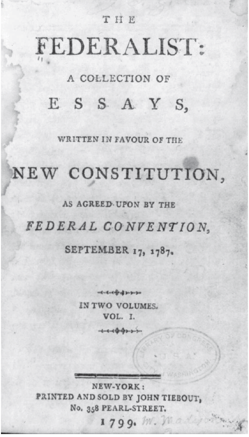
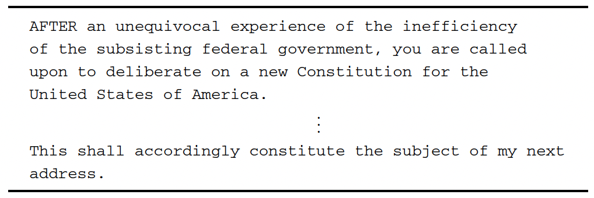

# Question 1

L'utilisation généralisée d'Internet a conduit à une quantité astronomique de données textuelles numérisées qui s'accumulent chaque seconde via les e-mails, les sites Web et les médias sociaux. L'analyse des sites de blog et des publications sur les réseaux sociaux peut donner de nouvelles perspectives sur le comportement et les opinions humains. Dans le même temps, des efforts à grande échelle pour numériser des articles publiés, des livres et des documents gouvernementaux ont été en cours, offrant des opportunités intéressantes de revoir des questions déjà étudiées, en analysant de nouvelles données.

Cet exemple est basé sur le papier de F. Mosteller and D.L. Wallace (1963) “Inference in an authorship problem.” Journal of the American Statistical Association, vol. 58, no. 302, pp. 275–309.

Vous allez analyser le texte **The Federalist**, plus communément appelé **The Federalist Papers**. Les *Federalist*, dont la page de titre est affichée ci-dessous se compose de 85 essais attribués à [Alexander Hamilton](https://www.penguinrandomhouse.com/authors/11693/alexander-hamilton/), [John Jay](https://www.penguinrandomhouse.com/authors/45268/john-jay/) et [James Madison](https://www.penguinrandomhouse.com/authors/18636/james-madison/) de 1787 à 1788 afin d'encourager les habitants de New York à ratifier la nouvelle constitution américaine. Parce que Hamilton et Madison ont contribué à la rédaction de la Constitution, les chercheurs considèrent les *Federalist Papers* comme un document principal reflétant les intentions des auteurs de la Constitution.

Les *Federalist Papers* ont été initialement publiés dans divers journaux de l'État de New York sous le pseudonyme de «Publius». Pour cette raison, la paternité de chaque article a fait l'objet de recherches savantes. Selon la *Library of Congress*, deux experts estiment que Hamilton a écrit 51 essais tandis que Madison en a rédigé 15. De plus, Hamilton et Madison ont rédigé conjointement 3 articles tandis que John Jay a écrit 5. Les 11 essais restants ont été écrits soit par Hamilton soit par Madison, bien que les chercheurs contestent lequel. L'objectif de cet exercice esr d'analyser le texte des *Federalist Papers pour prédire les auteurs des 11 essais.* 

Voici les documents connus pour être écrits par chaque auteur:

  - Hamilton: les numéros 1, 6–9, 11–13, 15–17, 21–36, 59–61 et 65–85. 
  - Madison: les numéros 10, 14, 37–48 et 58. 
  - Hamilton et Madison: les numéros 18–20. 
  - John Jay: les numéros  2–5 et 64.

Le texte des 85 essais est extrait du site Web de la Bibliothèque du Congrès et stocké sous le nom **fpXX.txt**, où XX représente le numéro d'essai allant de 01 à 85. Chaque fichier de données contient les données textuelles de son essai correspondant. Voir le tableau 5.1, qui affiche la première et la dernière page de **The Federalist Paper no. 1** à titre d'exemple.






1. Utiliser l'une des techniques de grattage apprises en classe pour gratter ce site https://guides.loc.gov/federalist-papers/full-text pour collecter les données et transformer le tableau en base de données. Vous pouvez remarquer que ces textes sont présentés par dizaine comme dans le lien ici: https://guides.loc.gov/federalist-papers/text-1-10

```{r}

```


Maintenant, vous allez utiliser le package tidytext pour analyser les données.
Voici les premiers codes qui vous permettent de télécharger ces données. Pour cet exemple, vous aurez besoin d'un ensemble de package que je vous charge aussi en même temps:

```{r}

rm(list = ls())
library(tidyverse)
library(lubridate)
library(stringr)
library(forcats)
library(modelr)
library(tm)
library(SnowballC)
library(tidytext)
library(wordcloud)

```

Ensuite, on va charger les données

```{r}

library(qss)

#data(package="qss")

DIR_SOURCE <- system.file("extdata/federalist", package = "qss")
corpus_raw <- VCorpus(DirSource(directory = DIR_SOURCE, pattern = "fp"))
corpus_raw

corpus_raw[[1]][1]

```

Vous pouvez enfin utiliser la fonction tidy pour transformer le corpus en base de données:

```{r}

corpus_tidy <- tidy(corpus_raw, "corpus")

```


2. Créer un nouvel identifiant nommé **id_num** qui prend la partie numérique de la variable **id**


3. Transformer cette base de données en tidytext en suivant l'ensemble du processus du pré-traitement vu en classe.

## Transformer le corpus en matrice documents-terms avec tm


4. Découverte des sujets

La découverte de sujets est un exemple d'**apprentissage non supervisé** parce que nous n'avons pas accès à de véritables informations sur l'affectation des sujets. C'est-à-dire qu'on ne sait pas, a priori, quels sujets existent dans le corpus et caractérisent chaque document. Nous souhaitons découvrir des sujets en analysant la distribution de la fréquence des termes/mots au sein d'un document donné et entre les documents. En revanche, dans l'**apprentissage supervisé**, les chercheurs utilisent un échantillon avec une variable de résultat observé pour en savoir plus sur la relation entre le résultat et les prédicteurs. Par exemple, nous pouvons demander à des codeurs humains de lire certains documents et d'attribuer des sujets. Nous pouvons ensuite utiliser ces informations pour prédire les sujets d'autres documents qui n'ont pas été lus. De toute évidence, le manque d'informations sur les variables de résultat rend les problèmes d'apprentissage non supervisés plus difficiles que les problèmes supervisés.

- Présenter le nuage des mots (wordcloud) qui utilise la fréquence des mots (tf) pour les documents 12 et 24. Commenter les résultats en essayant d'établir le/les sujets couverts par ces documents. Retenez les 20 mots les plus importants. N'oubliez pas que le package wordcloud utilise la matrice document-termes. Vous devez donc transformer votre donnée tidy au 3 en matrice document-termes que vous nommez **dtm**


5. Dans l'analyse ci-dessus, vous avez visualisé la distribution de la fréquence des termes dans chaque document. Cependant, la fréquence élevée d'un certain terme dans un document ne signifie pas grand-chose si ce terme apparaît souvent dans les documents du corpus. Pour résoudre ce problème, nous devons réduire la pondération des termes qui apparaissent fréquemment dans les documents. Cela peut être fait en calculant la statistique appelée fréquence de terme-fréquence de document inverse, ou tf-idf en abrégé. La statistique tf–idf est une autre mesure de l'importance de chaque terme dans un document donné. 

- Utiliser cette statistique pour présenter à nouveau les 20 mots les plus importants des documents 12 et 24. 

```{r}

```


Maintenant, si on voulait faire les mêmes choses mais avec le wordcloud, on doit transformer la base de données en matrice document-terms

```{r}

```

Utilisons maintenant la statistique tf_idf

```{r}


```


- Commenter vos nuages de points


6. Maintenant, vous aller considérer une approche alternative pour découvrir les sujets, en identifiant des groupes d'essais similaires, sur la base de la mesure tf-idf. 

- Sélectionner les éssais écrits par Hamilton. 


```{r}


```

- Appliquer l'algorithme des k-moyennes [k-means](https://www.rdocumentation.org/packages/stats/versions/3.6.2/topics/kmeans) à la matrice document-terme pondérée. Retenez 4 comme nombre de clusters. Bien qu'arbitraire, ce choix produit des clusters qui semblent raisonnables. 

On peut utiliser un algorithme pour séparer les données. L'un de ses algorithmes est appelé le k-mean. L'algorithme k-means est un algorithme itératif dans lequel un ensemble d'opérations est effectué à plusieurs reprises jusqu'à ce qu'une différence notable dans les résultats ne soit plus produite. Le but de l'algorithme est de diviser les données en k groupes similaires où chaque groupe est associé à son centre de gravité, qui est égal à la moyenne intra-groupe. Pour cela, vous devez d'abord attribuer chaque observation à son cluster le plus proche, puis calculer le centroïde de chaque cluster en fonction de cette nouvelle affectation de cluster. Ces deux étapes sont répétées jusqu'à ce que l'affectation de cluster ne change plus. Notez que les chercheurs doivent choisir le nombre de grappes k et le centroïde initial de chaque grappe. Dans R, les emplacements initiaux des centroïdes sont sélectionnés au hasard, sauf indication contraire.


```{r}


```


- Présenter les 10 mots de chaque centroïde des clusters.


```{r}


```

- Graphique des 4 clusters

```{r}


```

- Commenter les résultats


## Tableau des mots les plus importants


```{r}


```

- Quels sont les documents qui sont les plus associés à ces mots


```{r}


```


7. Maintenant utiliser la méthode des **topic modelling** vue en classe pour déterminer les sujets dans les éssais de Hamilton. 

Cet exercice utilise **The Federalist Papers** pour illustrer comment les analyses de texte peuvent révéler des sujets. Bien sûr, étant donné que nous pouvons facilement lire tous les Federalist Papers, l'analyse de texte automatisée peut ne pas être nécessaire dans ce cas. Cependant, des techniques similaires et plus avancées peuvent être appliquées à un corpus beaucoup plus vaste que les humains auraient du mal à lire en entier en peu de temps. Dans de telles situations, l'analyse de texte automatisée peut jouer un rôle essentiel en aidant les chercheurs à extraire des informations significatives à partir de données textuelles.


```{r}


```


- Graphique

```{r}


```

## Essayer de faire la même chose en utilisant à la place des fréquences de terme, la statsistique tf-idf


```{r}

```


8. Prédire l'auteur des 11 essais sans auteur

Comme mentionné précédemment, la paternité de certains des documents fédéralistes est inconnue. Nous utiliserons les 66 essais attribués à Hamilton ou à Madison pour prédire la paternité des 11 articles contestés. Étant donné que chaque article fédéraliste traite d'un sujet différent, vous allez vous concentrer sur l'utilisation des articles, des prépositions et des conjonctions. En particulier, vous aller analyser la fréquence d'utilisation des 10 mots suivants par les deux auteurs: **although, always, commonly, consequently, considerable, enough, there, upon, while, whilst**. Ces mots sont sélectionnés sur la base de l'analyse présentée dans l'article académique qui a inspiré cet exercice. En conséquence, vous devez utiliser le corpus sans la stemmisation. 

- Créer une base données avec les identifiants des essais de chaque auteur avec le nom des auteurs. Cette nouvelle base de données que vous appelez known_essays doit avoir deux variables (document et author)


```{r}


```

Commenter les résultats? Quels sont les mots préférés par chaque auteur?

Les résultats suggèrent que Hamilton préfère utiliser des termes tels que **there** et **upon**, que Madison utilise rarement, préférant plutôt utiliser **consequentlty** et **whilst**. Nous utiliserons la fréquence de ces 4 mots comme prédicteurs d'un modèle de régression linéaire, où la variable de résultat est la paternité d'un essai. Nous avons d'abord ajusté ce modèle de régression linéaire aux 66 essais dont la paternité est connue pour estimer les coefficients. Le modèle ajusté résultant peut ensuite être utilisé pour prédire la paternité inconnue des 11 essais sur la base des fréquences des 4 mots. Pour le modèle de régression linéaire, nous créons d'abord la variable de résultat en codant les essais rédigés par Hamilton comme 1 et ceux écrits par Madison comme -1. Nous construisons ensuite une base de données, qui contient cette variable de paternité ainsi que le terme matrice de fréquence tfm pour tous les essais dont la paternité est connue.

- Utiliser la fréquence de ces mots pour prédire l'authorship des 11 éssais qui n'ont pas d'auteurs

```{r}


```


## Cross-validation

La validation croisée est une méthodologie permettant d'évaluer l'exactitude de la prédiction du modèle sans s'appuyer sur la prédiction dans l'échantillon, ce qui conduit souvent à un surajustement. Supposons que nous ayons un échantillon de n observations. Ensuite, la procédure de validation croisée Leave-one-out répète les étapes suivantes pour chaque observation i = 1, . . . , n :
1. Sortez la ième observation et mettez-la de côté.
2. Ajuster le modèle en utilisant les n − 1 observations restantes.
3. À l'aide du modèle ajusté, prédisez le résultat de la ième observation et calculez l'erreur de prédiction.
Enfin, calculez l'erreur de prédiction moyenne sur n observations comme mesure de la précision de la prédiction.

https://rpubs.com/dgrtwo/cv-modelr
https://drsimonj.svbtle.com/k-fold-cross-validation-with-modelr-and-broom

```{r}


```


## Utilisation de l'apprentissage automatique


## Références


https://guides.loc.gov/federalist-papers/text-1-10#s-lg-box-wrapper-25493264

https://guides.loc.gov/federalist-papers/text-1-10#s-lg-box-wrapper-25493265