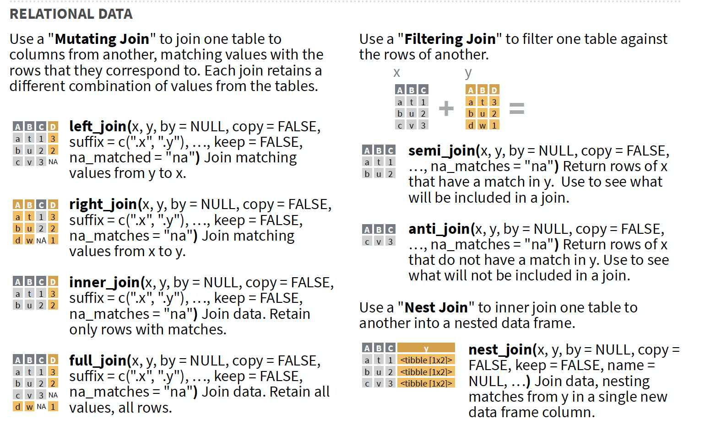

# Processing des données

Dans ce labo, je vais vous apprendre comment transformer vos données textuelles en une base prête pour l'analyse. 
Cette base peut prendre deux formes:

- Matrice documents-termes
- Données tidy


## Introduction

Nous utiliserons deux packages pour faire l'analyse quantitative du texte: tm qui travaille sur les `document text-matrix` et *tidytext* qui utilise `tidy-data`. D'autres packages sont le [stm](https://cran.r-project.org/web/packages/stm/vignettes/stmVignette.pdf), [topicsmodels](https://cran.r-project.org/web/packages/topicmodels/vignettes/topicmodels.pdf) et [quanteda](https://quanteda.io/)

## Type de données

1. Matrice Documents-termes 

Une façon rapide d'explorer des données textuelles consiste à simplement compter les occurrences de chaque mot ou terme. Le nombre de fois qu'un mot particulier apparaît dans un document donné est appelé *term frequence* (tf) en anglais ou fréquence des termes. La statistique tf peut être résumée dans une matrice nommée Documents-termes, qui est un tableau rectangulaire avec des lignes représentant des documents et des colonnes représentant des termes uniques. L'élément (i, j) de cette matrice donne les décomptes du $j^{ème}$ terme (colonne) dans le $i^{ème}$ document (ligne). Nous pouvons également inverser les lignes et les colonnes et convertir une matrice documents-termes en une matrice de termes-documents où les lignes et les colonnes représentent respectivement les termes et les documents.


  2. Tidy-data

L'utilisation de principes de données bien rangées est un moyen puissant de rendre la gestion des données plus facile et plus efficace, et cela n'est pas moins vrai lorsqu'il s'agit de traiter du texte. Comme décrit par Hadley Wickham (Wickham 2014), les données bien rangées ont une structure spécifique:

- Chaque variable est une colonne
- Chaque observation est une rangée
- Chaque type d'unité d'observation est un tableau

Nous définissons donc le format de texte bien rangé (tidy-text) comme étant une table avec un jeton (token) par ligne. Un jeton est une unité de texte significative, comme un mot, que nous souhaitons utiliser pour l'analyse, et la **tokenisation** est le processus de division du texte en jetons (mots). Cette structure d'un jeton par ligne contraste avec la façon dont le texte est souvent stocké dans les analyses actuelles, peut-être sous forme de chaînes ou dans une matrice documents-termes. Pour l'exploration de texte ordonnée, le jeton qui est stocké dans chaque ligne est le plus souvent un seul mot, mais peut également être un n-gramme, une phrase ou un paragraphe. Nous utiliserons le packaqge **tidytext** convertir les documents en un seul terme par ligne.


## Ressources

https://quanteda.io/reference/dictionary.html
https://rpubs.com/tsholliger/301914
https://www.tidytextmining.com/tidytext.html
https://cran.r-project.org/web/packages/stm/vignettes/stmVignette.pdf


## 1. Dressons la table


```{r}

# Effacer l'environnement
rm(list = ls())

# Installer les différents packages
#install.packages("tm")

# Charger les packages

library(tidyverse)
library(tidytext)
library(tm)
library(maps)
library(SnowballC)
library(wordcloud)

```


## 2. Creation du corpus avec le package tm

Pour transformer les textes en matrice documents-termes, nous aurons besoin des fonctions suivantes:


```{r}

 #load(url("https://cbail.github.io/Trump_Tweets.Rdata"))

trumptweets <- readRDS("../Données/trumptweets.Rdata")
head(trumptweets)
trumptweets$text[2]

```

Maintenant, on va créer le corpus avec ces tweets. Chaque tweet va être considérer comme un document et les mots utilisés dans le tweet comme les termes. Chaque tweet devient un document.


```{r}
  

trump_corpus <- Corpus(VectorSource(as.vector(trumptweets$text)))     

trump_corpus
View((trump_corpus))

# Les informations de chaque document
trump_corpus[[1]][["content"]]    
trump_corpus[[1]][["meta"]]

```


```{r}

# Enlever les chiffres

trump_corpus <- tm_map(trump_corpus, content_transformer(removeNumbers))  

# Transformer en minuscule
trump_corpus <- tm_map(trump_corpus,  content_transformer(tolower)) 

# Enlever les espaces
trump_corpus <- tm_map(trump_corpus, content_transformer(stripWhitespace))

# Stemming
trump_corpus  <- tm_map(trump_corpus, content_transformer(stemDocument), language = "english")


# Document-term matrix


trump_DTM <- DocumentTermMatrix(trump_corpus, control = list(wordLengths = c(5, Inf)))

inspect(trump_DTM[1:6,1:10])

?DocumentTermMatrix()


trump_DTM_matrix <- as.matrix(trump_DTM)
trump_DTM_matrix[1:5,1:8]

```


## 3. Tidy text

On va d'abord créer les données tidy avant de les transformer. Ici, chaque tweet peut être identifié par sa date de création.

```{r}

tidy_trump_tweets <- 
  trumptweets %>% 
  select(created_at, text) %>% 
  unnest_tokens("word", text)     # Tokenise the data
  
tidy_trump_tweets  

tidy_trump_tweets %>% 
  count(word) %>% 
  arrange(desc(n))


  
```

### 4. Text pre-processing

Pour enlever les mots "inutiles", on va merger (fusionner) notre base de données avec la base de données de ces mots. Cette base de données de mots inutiles existe sous le nom de **stopwords**. Une fusion par **anti_join**, où n'est retenu que ce qui se trouve dans la base A et pas dans la base B est retenue.



```{r}

data("stop_words")
head(stopwords(), 24)

tidy_trump_tweets <- 
  tidy_trump_tweets %>% 
  anti_join(stop_words)

tidy_trump_tweets %>% 
  count(word) %>% 
  arrange(desc(n))

```

On se rend compte qu'il existe toujours des termes qui ne veulent rien dire. Nous pouvons donc créer une base de données à partir de ces mots et continuer l'anti_join.

```{r}
http_trump <- data.frame(word = c("https", "t.co", "amp", "rt"))
http_trump

tidy_trump_tweets <-
  tidy_trump_tweets %>% 
  anti_join(http_trump) 
  
tidy_trump_tweets  %>% 
  count(word) %>% 
  arrange(desc(n))

```

Maintenant, il faut continuer la transformation en :
- enlevant les chiffres
- les espaces

Remarquons que tidytext transforme le texte en minuscule. Donc, nous n'avons plus besoin de faire de changement à ce niveau.

```{r}

# Enlever les chiffres

#tidy_trump_tweets <- tidy_trump_tweets[-grep("\\b\\d+\\b", tidy_trump_tweets$word),]

tidy_trump_tweets <-
  tidy_trump_tweets %>% 
  filter(!grepl("\\b\\d+\\b", word))


# Enlever les espaces

#tidy_trump_tweets$word <- gsub("\\s+","",tidy_trump_tweets$word)    

tidy_trump_tweets <-
  tidy_trump_tweets %>% 
  mutate(word = gsub("\\s+","", word))


# Stemming
#library(SnowballC)

tidy_trump_tweets <- tidy_trump_tweets %>%
  mutate_at("word", funs(wordStem((.), language="en")))


#tidy_trump_tweets <-
#  tidy_trump_tweets %>% 
#  filter(!grepl("https|t.co|amp|rt", word))

tidy_trump_tweets %>% 
  count(word) %>% 
  arrange(desc(n))


country
countries

```

Finalement, à partir des données tidy, on peut créer une matrice documents-termes


```{r}

# Document-term matrix
tidy_trump_DTM <-
  tidy_trump_tweets %>%
  count(created_at, word) %>%
  cast_dtm(created_at, word, n)

inspect(tidy_trump_DTM[1:5, 1:8])

```

Maintenant que nous avons transformer notre texte en base de données/matrice, nous pouvons en sortir rapidement quelques caractéristiques.

# Analyse: Découverte des topics

Parmi les formes les plus élémentaires d'analyse quantitative de texte figurent les techniques de comptage de mots et les méthodes basées sur un dictionnaire. Ce labo couvrira ces deux sujets, ainsi que l'analyse des sentiments, qui est une forme d'analyse de texte basée sur un dictionnaire (labo suivant). 

## Fréquence des mots avec tidytext


```{r}

# Fréquences des mots

tidy_trump_tweets %>% 
  count(word, sort = TRUE)

tidy_trump_tweets %>%          
  count(word) %>% 
  arrange(desc(n))

# Graphique des 20 mots les plus importants

top_20 <- 
  tidy_trump_tweets %>% 
  count(word, sort = TRUE) 

top_20 <- top_20[1:20, ]    
  
top_20  

 
ggplot(top_20) +
  geom_col(aes(x = word, y = n, fill = word)) +
  theme_bw() +
  theme(axis.text = element_text(angle = 90, hjust = 1)) +
  ylab("Number of time a word appears in a tweet") +
  xlab("word") +
  guides(fill = FALSE) 


```

## tf-idf

Que vaut finalement un mot: la statistique tfidf


Bien que nous ayons déjà supprimé les «mots vides» très courants de notre analyse, il est courant dans l'analyse quantitative de texte d'identifier les mots inhabituels qui pourraient différencier un document des autres (cela deviendra particulièrement important lorsque nous passerons à des formes plus avancées de reconnaissance des formes dans le texte plus tard). La métrique la plus communément utilisée pour identifier ces mots inhabituels est «Term Frequency - Inverse Document Frequency» (tf-idf). Nous pouvons calculer le tf-idf pour les tweets Trump basés sur des données en tidytext comme suit:


```{r}

tidy_trump_tweets_tfidf <-
  tidy_trump_tweets %>% 
  count(word, created_at) %>% 
  bind_tf_idf(word, created_at, n)
              

top_tfidf <- 
  tidy_trump_tweets_tfidf %>%
  arrange(desc(tf_idf))

top_tfidf


```

Plus le score TFIDF (poids) est élevé, plus le terme est rare dans un document donné et vice versa.

```{r}


tidy_trump_tfidf<- trumptweets %>%
  select(created_at,text) %>%
  unnest_tokens("word", text) %>%
  anti_join(stop_words) %>%
  count(word, created_at) %>%
  bind_tf_idf(word, created_at, n) %>% 
  filter(tf_idf < 4)


top_tfidf <- tidy_trump_tfidf %>%
  arrange(desc(tf_idf))

top_tfidf
top_tfidf$word[1]


```

Le tfidf augmente à mesure qu'un terme apparaît dans un document, mais il est pondéré négativement par la fréquence globale des termes dans tous les documents de l'ensemble de données ou du corpus. En termes plus simples, le tf-idf nous aide à saisir quels mots sont non seulement importants dans un document donné, mais aussi distinctifs vis-à-vis du corpus plus large ou de l'ensemble de données tidytext.


## Fréquence des mots avec tm

```{r}

# Wordcount   (Marche avec document-term Matrix)

head(tidy_trump_tweets)

dtm_trumptweets <- 
  tidy_trump_tweets %>% 
  count(created_at, word) %>% 
  cast_dtm(created_at, word, n)

dtm_trumptweets

inspect(dtm_trumptweets[1:5,1:8])

# Comme une matrice

dtm_trumptweets_matrix <- as.matrix(dtm_trumptweets)

dtm_trumptweets_matrix[1:5,1:8]


dtm_trumptweets_matrix %>% {
  wordcloud(.$word, .$n, max.words = 20)
}


```


# Références

https://www.tidytextmining.com/sentiment.html
https://www.datacamp.com/community/tutorials/sentiment-analysis-R
https://www.datacamp.com/community/tutorials/R-nlp-machine-learning
