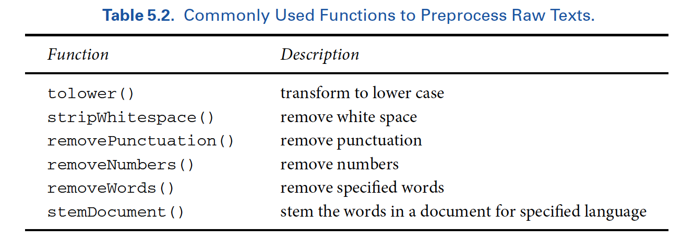

## 1. Dressons la table


```{r}

# Effacer l'environnement
rm(list = ls())

# Installer les différents packages


# Charger le packages

library(tidyverse)
library(lubridate)
library(stringr)
library(forcats)
library(modelr)
library(tidytext)
library(tm)
library(maps)
library(SnowballC)
library(wordcloud)

```


## 2. Creation du corpus avec le package tm

Pour transformer les textes en matrice documents-termes, nous aurons besoin des fonctions suivantes:




```{r}


DIR_SOURCE <- system.file("extdata/federalist", package = "qss")
corpus_raw <- VCorpus(DirSource(directory = DIR_SOURCE, pattern = "fp"))
corpus_raw

```

Maintenant, on va créer le corpus avec ces tweets. Chaque tweet va être considérer comme un document et les mots utilisés dans le tweet comme les termes. Chaque tweet devient un document.


```{r}
  
trump_corpus <- Corpus(VectorSource(as.vector(trumptweets$text)))     

trump_corpus
View((trump_corpus))

# Les informations de chaque document
trump_corpus[[2]][["content"]]    
trump_corpus[[2]][["meta"]]

# Enlever les chiffres
trump_corpus <- tm_map(trump_corpus, content_transformer(removeNumbers))  

# Transformer en minuscule
trump_corpus <- tm_map(trump_corpus,  content_transformer(tolower)) 

# Enlever les espaces
trump_corpus <- tm_map(trump_corpus, content_transformer(stripWhitespace))

# Stemming
trump_corpus  <- tm_map(trump_corpus, content_transformer(stemDocument), language = "english")


# Document-term matrix

trump_DTM <- DocumentTermMatrix(trump_corpus, control = list(wordLengths = c(3, Inf)))
inspect(trump_DTM[1:5,1:8])

?DocumentTermMatrix()


trump_DTM_matrix <- as.matrix(trump_DTM)
trump_DTM_matrix[1:5,1:8]
```


## 3. Tidy text

On va d'abord créer les données tidy avant de les transformer. Ici, chaque tweet peut être identifié par sa date de création.

```{r}

tidy_trump_tweets <- 
  trumptweets %>% 
  select(created_at, text) %>% 
  unnest_tokens("word", text)     # Tokenise the data
  
tidy_trump_tweets  

tidy_trump_tweets %>% 
  count(word) %>% 
  arrange(desc(n))


  
```

### 4. Text pre-processing

Pour enlever les mots "inutiles", on va merget notre base de données avec la base de données de ces mots. Cette base existe sous le nom stop-word. Une fusion par **anti_join**, où n'est retenu que ce qui se trouve dans la base A et pas dans la base B est retenu.

```{r}

data("stop_words")
head(stopwords(), 15)

tidy_trump_tweets <- 
  tidy_trump_tweets %>% 
  anti_join(stop_words)

tidy_trump_tweets %>% 
  count(word) %>% 
  arrange(desc(n))

```

On se rend compte qu'il existe toujours toujours des termes qui ne veulent rien dire. Nous pouvons donc créer une base de données à partir de ces mots et continuer l'anti_join.

```{r}
http_trump <- data.frame(word = c("https", "t.co", "amp", "rt"))
http_trump

tidy_trump_tweets <-
  tidy_trump_tweets %>% 
  anti_join(http_trump) 
  
tidy_trump_tweets  %>% 
  count(word) %>% 
  arrange(desc(n))

```

Maintenant, il faut continuer la transformation en :
- enlevant les chiffres
- les espaces

Remarquons que tidytext transforme le texte en miniscule. Donc, nous n'avons plus besoin de faire de changement en ce niveau.

```{r}
# Enlever les chiffres

tidy_trump_tweets <- tidy_trump_tweets[-grep("\\b\\d+\\b", tidy_trump_tweets$word),]


# Enlever les espaces
tidy_trump_tweets$word <- gsub("\\s+","",tidy_trump_tweets$word)    

# Stemming
library(SnowballC)

tidy_trump_tweets<-tidy_trump_tweets %>%
  mutate_at("word", funs(wordStem((.), language="en")))

```

Finalement, à partir des données tydy, on peut créer une matrice document-terme


```{r}

# Document-term matrix
tidy_trump_DTM<-
  tidy_trump_tweets %>%
  count(created_at, word) %>%
  cast_dtm(created_at, word, n)

inspect(tidy_trump_DTM[1:5, 1:8])

```

Maintenant que nous avons transofmer notre texte en base de données/matrice, nous pouvons en sortir rapidement quelques caractéristiques.

# Analyse: Découverte des topics

Parmi les formes les plus élémentaires d'analyse quantitative de texte figurent les techniques de comptage de mots et les méthodes basées sur un dictionnaire. Ce labo couvrira ces deux sujets, ainsi que l'analyse des sentiments, qui est une forme d'analyse de texte basée sur un dictionnaire (labo suivant). 

## Fréquence des mots avec tidytext


```{r}

# Fréquences des mots

tidy_trump_tweets %>% 
  count(word, sort = TRUE)

tidy_trump_tweets %>%          # Same as previously but with arrange
  count(word) %>% 
  arrange(desc(n))

# Graphique des 20 mots les plus importants

top_20 <- 
  tidy_trump_tweets %>% 
  count(word, sort = TRUE) 

top_20 <- top_20[1:20, ]    
  
top_20  

 
ggplot(top_20) +
  geom_col(aes(x = word, y = n, fill = word)) +
  theme_bw() +
  theme(axis.text = element_text(angle = 90, hjust = 1)) +
  ylab("Number of time a word appears in a tweet") +
  xlab("word") +
  guides(fill = FALSE)


```

## tf-idf

Que vaut finalement un mot: la statistique tfidf


Bien que nous ayons déjà supprimé les «mots vides» très courants de notre analyse, il est courant dans l'analyse quantitative de texte d'identifier les mots inhabituels qui pourraient différencier un document des autres (cela deviendra particulièrement important lorsque nous passerons à des formes plus avancées de reconnaissance des formes dans le texte plus tard). La métrique la plus communément utilisée pour identifier ces mots inhabituels est «Term Frequency Frequency Inverse Document Frequency» (tf-idf). Nous pouvons calculer le tf-idf pour les tweets Trump basés sur des données en tidytext comme suit:


```{r}

tidy_trump_tweets_tfidf <-
  tidy_trump_tweets %>% 
  count(word, created_at) %>% 
  bind_tf_idf(word, created_at, n)
              

top_tfidf <- 
  tidy_trump_tweets_tfidf %>%
  arrange(desc(tf_idf))

top_tfidf


```

Plus le score TFIDF (poids) est élevé, plus le terme est rare dans un document donné et vice versa.

```{r}


tidy_trump_tfidf<- trumptweets %>%
  select(created_at,text) %>%
  unnest_tokens("word", text) %>%
  anti_join(stop_words) %>%
  count(word, created_at) %>%
  bind_tf_idf(word, created_at, n) %>% 
  filter(tf_idf < 4)


top_tfidf <- tidy_trump_tfidf %>%
  arrange(desc(tf_idf))

top_tfidf$word[1]


```

Le tfidf augmente à mesure qu'un terme apparaît dans un document, mais il est pondéré négativement par la fréquence globale des termes dans tous les documents de l'ensemble de données ou du corpus. En termes plus simples, le tf-idf nous aide à saisir quels mots sont non seulement importants dans un document donné, mais aussi distinctifs vis-à-vis du corpus plus large ou de l'ensemble de données tidytext.


## Fréquence des mots avec tm

```{r}

# Wordcount   (Work with document-term Matrix)

head(tidy_trump_tweets)

dtm_trumptweets <- 
  tidy_trump_tweets %>% 
  count(created_at, word) #%>% 
  #cast_dtm(created_at, word, n)

dtm_trumptweets

dtm_trumptweets %>% {
  wordcloud(.$word, .$n, max.words = 20)
}


inspect(trump_DTM[1:5,1:8])

trump_DTM %>% {
  wordcloud(.$word, .$n, max.words = 20)
}
```


# Références

https://www.tidytextmining.com/sentiment.html
https://www.datacamp.com/community/tutorials/sentiment-analysis-R
https://www.datacamp.com/community/tutorials/R-nlp-machine-learning
