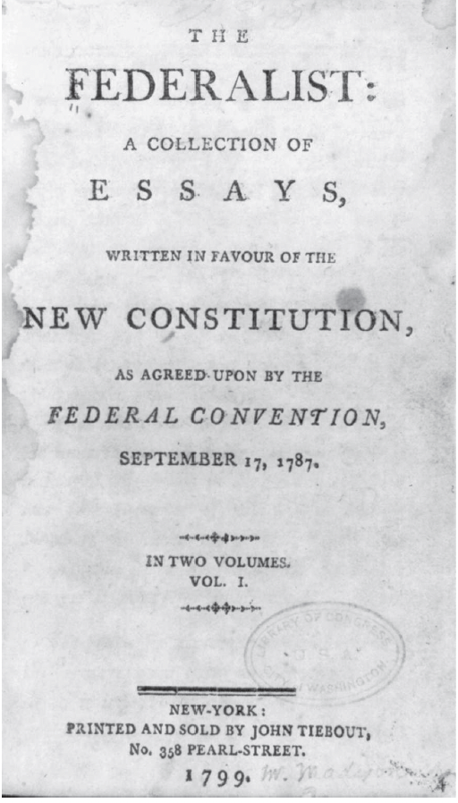
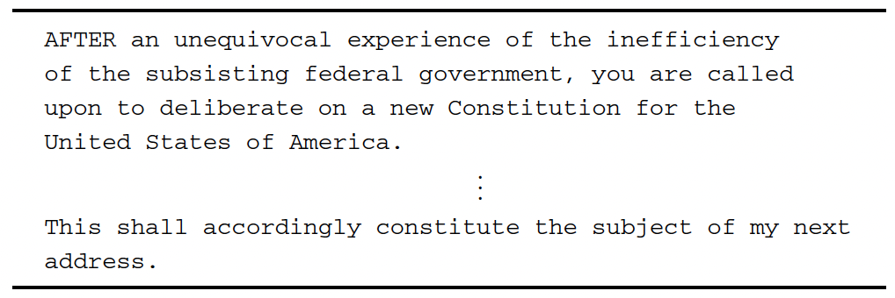

<!--
## Code for the tokenization

```{r}
samples <- c("The cat sat on the mat.", "The dog ate my homework.") 

token_index <- list()                                                     
for (sample in samples)
  for (word in strsplit(sample, " ")[[1]])                                
    if (!word %in% names(token_index))
      token_index[[word]] <- length(token_index) + 2                      

max_length <- 10                                                          
results <- array(0, dim = c(length(samples),
                            max_length,
                            max(as.integer(token_index))))                
for (i in 1:length(samples)) {
  sample <- samples[[i]]
  words <- head(strsplit(sample, " ")[[1]], n = max_length)
  for (j in 1:length(words)) {
    index <- token_index[[words[[j]]]]
    results[[i, j, index]] <- 1
  }
}
```

-->

# Question 1

L'utilisation généralisée d'Internet a conduit à une quantité astronomique de données textuelles numérisées qui s'accumulent chaque seconde via les e-mails, les sites Web et les médias sociaux. L'analyse des sites de blog et des publications sur les réseaux sociaux peut donner de nouvelles perspectives sur le comportement et les opinions humains. Dans le même temps, des efforts à grande échelle pour numériser des articles publiés, des livres et des documents gouvernementaux ont été en cours, offrant des opportunités intéressantes de revoir des questions déjà étudiées, en analysant de nouvelles données.

Cet exemple est basé sur le papier de F. Mosteller and D.L. Wallace (1963) “Inference in an authorship problem.” Journal of the American Statistical Association, vol. 58, no. 302, pp. 275–309.

Vous allez analyser le texte **The Federalist**, plus communément appelé **The Federalist Papers**. Les *Federalist*, dont la page de titre est affichée ci dessous se compose de 85 essais attribués à [Alexander Hamilton](https://www.penguinrandomhouse.com/authors/11693/alexander-hamilton/), [John Jay](https://www.penguinrandomhouse.com/authors/45268/john-jay/) et [James Madison](https://www.penguinrandomhouse.com/authors/18636/james-madison/) de 1787 à 1788 afin d'encourager les habitants de New York à ratifier la nouvelle constitution américaine. Parce que Hamilton et Madison ont contribué à la rédaction de la Constitution, les chercheurs considèrent les *Federalist Papers* comme un document principal reflétant les intentions des auteurs de la Constitution.

Les *Federalist Papers* ont été initialement publiés dans divers journaux de l'État de New York sous le pseudonyme de «Publius». Pour cette raison, la paternité de chaque article a fait l'objet de recherches savantes. Selon la *Library of Congress*, deux experts estiment que Hamilton a écrit 51 essais tandis que Madison en a rédigé 15. De plus, Hamilton et Madison ont rédigé conjointement 3 articles tandis que John Jay a écrit 5. Les 11 essais restants ont été écrits soit par Hamilton soit par Madison, bien que les chercheurs contestent lequel. L'objectif de cet exercice esr d'analyser le texte des *Federalist Papers pour prédire les auteurs des 11 essais.* 

Voici les documents connus pour être écrits par chaque auteur:

  - Hamilton: les numéros 1, 6–9, 11–13, 15–17, 21–36, 59–61 et 65–85. 
  - Madison: les numéros 10, 14, 37–48 et 58. 
  - Hamilton et Madison: les numéros 18–20. 
  - John Jay: les numéros  2–5 et 64.

Le texte des 85 essais est extrait du site Web de la Bibliothèque du Congrès et stocké sous le nom **fpXX.txt**, où XX représente le numéro d'essai allant de 01 à 85. Chaque fichier de données contient les données textuelles de son essai correspondant. Voir le tableau 5.1, qui affiche la première et la dernière page de **The Federalist Paper no. 1** à titre d'exemple.






1. Utiliser l'une des techniques de grattage apprises en classe pour gratter ce site https://guides.loc.gov/federalist-papers/full-text pour collecter les données et transformer le tableau en base de données. Vous pouvez remarquer que ces textes sont présentés par dizaine comme dans le lien ici: https://guides.loc.gov/federalist-papers/text-1-10


```{r}

rm(list = ls())

library(tidyverse)
library(magrittr)
library(rvest)

webpage <- read_html("https://guides.loc.gov/federalist-papers/text-1-10") 

section <- html_nodes(webpage, css = ".s-lib-box-std")
section[[1]][[2]]

file <- html_text(section)
file
#webpage_text <- webpage %>% 
#  html_nodes("p") %>% 
#  html_text()
#webpage_text
#https://www.youtube.com/watch?v=smriIBG08ok

page_section <- html_node(webpage, xpath = '//*[@id="s-lg-col-1"]/div')

#'//*[@id="s-lg-box-wrapper-25493264"]'

file <- html_text(page_section)
file

data1 <- data_frame(text = file)
data1$text
data1 <-
  data1 %>% 
  separate(text, into = c("text1", "text2", "text3", "text4", "text5", 
                          "text6", "text7", "text8", "text9", "text10"), sep = "Back to text")

## cs selector

page_section1 <- html_node(webpage, css = ".s-lg-box-wrapper-25493264 .s-lib-box-std")
file1 <- html_text(page_section1)
file1

# Approche 1

page <- c("1-10", "11-20", "21-30", "31-40", "41-50", "51-60", "61-70", "71-80", "81-85")
length(page)

for(i in seq_along(page)) {
  data <- read_html(webpage) %>%
    html_nodes("table") %>%
    //*[@id="s-lg-box-wrapper-25493264"] %>% 
    html_table()

  webpage <- html_session(webpage) %>% follow_link(css = ".pager-next a") %>% .[["url"]]
}

?follow_link


# Approche 2

for(i in 0:1) {
  webpage <- read_html(paste0("https://bra.areacodebase.com/number_type/M?page=", i))
  data <- webpage %>%
    html_nodes("table") %>%
    .[[1]] %>% 
    html_table()
}


webpage_section <- html_node(webpage, css = '.views-field')
web_table <- html_text(webpage_section)
web_table
#//*[@id="block-system-main"]/div/div/div[1]/table/tbody


```


Maintenant, vous allez utiliser le package tidytext pour analyser les données.
Voici les premiers codes qui vous permettent de télécharger ces données. Pour cet exemple, vous aurez besoin d'un ensemble de package que je vous charge aussi en même temps:

```{r}

rm(list = ls())
library(tidyverse)
library(lubridate)
library(stringr)
library(forcats)
library(modelr)
library(tm)
library(SnowballC)
library(tidytext)
library(wordcloud)


```

Ensuite, on va charger les données

```{r}

# Comment accéder aux données https://github.com/kosukeimai/qss-package/blob/master/README.md

#federalist_dir <- system.file("extdata", "federalist", package = "qss")
#dir(federalist_dir)
#corpus.raw1 <- Corpus(DirSource(federalist_dir))
#corpus.raw1
#corpus.raw1[[1]][1]


library(qss)

#data(package="qss")

DIR_SOURCE <- system.file("extdata/federalist", package = "qss")
corpus_raw <- VCorpus(DirSource(directory = DIR_SOURCE, pattern = "fp"))
corpus_raw

corpus_raw[[1]][1]


?VCorpus

```

Vous pouvez enfin utiliser la fonction tidy pour transformer le corpus en base de données:

```{r}

corpus_tidy <- tidy(corpus_raw, "corpus")

```


2. Créer un nouvel identifiant nommé **id_num** qui prend la partie numérique de la variable **id**


```{r}

corpus_tidy <- corpus_tidy %>% 
  mutate(id_num1 = str_sub(id, 3, 4),
         id_num = as.integer(str_extract(id, pattern = "\\d+")))

class(corpus_tidy$id_num)

```


3. Transformer cette base de données en tidytext en suivant l'ensemble du processus du pré-traitement vu en classe.

```{r}

corpus_tidy_text <- corpus_tidy %>% 
  select(id_num, text) %>% 
  unnest_tokens("word", text)

# delete stopwords

corpus_tidy_text <-
  corpus_tidy_text %>% 
  anti_join(stop_words)

# delete numbers

corpus_tidy_text <-
  corpus_tidy_text %>% 
  filter(!grepl("\\b\\d+\\b", word))

# delete space

corpus_tidy_text <-
  corpus_tidy_text %>% 
  mutate(word = gsub("\\s", "", word))

# Stemming and lemmatisation

corpus_tidy_text <-
  corpus_tidy_text %>% 
  mutate_at("word", funs(wordStem((.), language = "en")))
  #mutate(word_st = wordStem(word, language = "en"))

corpus_tidy_text %>% 
  group_by(word) %>% 
  count(word, sort = TRUE)

```

## Transformer le corpus en matrice documents-terms avec tm

```{r}

corpus_dtm <- 
  corpus_tidy_text %>% 
  count(id_num, word) %>% 
  cast_dtm(id_num, word, n)

inspect(corpus_dtm[1:5,1:8])

#data <- tidy(corpus_dtm)

```


4. Découverte des sujets

La découverte de sujets est un exemple d'**apprentissage non supervisé** parce que nous n'avons pas accès à de véritables informations sur l'affectation des sujets. C'est-à-dire qu'on ne sait pas, a priori, quels sujets existent dans le corpus et caractérisent chaque document. Nous souhaitons découvrir des sujets en analysant la distribution de la fréquence des termes/mots au sein d'un document donné et entre les documents. En revanche, dans l'**apprentissage supervisé**, les chercheurs utilisent un échantillon avec une variable de résultat observé pour en savoir plus sur la relation entre le résultat et les prédicteurs. Par exemple, nous pouvons demander à des codeurs humains de lire certains documents et d'attribuer des sujets. Nous pouvons ensuite utiliser ces informations pour prédire les sujets d'autres documents qui n'ont pas été lus. De toute évidence, le manque d'informations sur les variables de résultat rend les problèmes d'apprentissage non supervisés plus difficiles que les problèmes supervisés.

- Présenter le nuage des mots (wordcloud) qui utilise la fréquence des mots (tf) pour les documents 12 et 24. Commenter les résultats en essayant d'établir le/les sujets couverts par ces documents. Retenez les 20 mots les plus importants. N'oubliez pas que le package wordcloud utilise la matrice document-termes. Vous devez donc transformer votre donnée tidy au 3 en matrice document-termes que vous nommez **dtm**

```{r}

graph_doc <- function(donnee){
  ggplot(donnee) +
    geom_col(aes(x = reorder(word, desc(n)), y = n, fill = word), show.legend = FALSE) +
    labs(x = "Word") +
    coord_flip() #+
    #guides(color = FALSE)
}

#show.legend = FALSE

doc12 <- corpus_tidy_text %>% 
  filter(id_num == 12) %>% 
  group_by(word) %>% 
  count() %>% 
  arrange(desc(n))

doc12_10 <- doc12[1:10, ]


# Nuage document 12

graph_doc(doc12_10)

# Nuage document 24

doc24 <- corpus_tidy_text %>% 
  filter(id_num == 24) %>% 
  group_by(word) %>% 
  count() %>% 
  arrange(desc(n))

doc24_10 <- doc24[1:10, ]

graph_doc(doc24_10)

```

- 

Combinons les deux graphiques ensemble

```{r}

doc12_10 <-
  doc12_10 %>% 
  mutate(id = row_number())


doc24_10 <-
  doc24_10 %>% 
  mutate(id = 2*row_number())

doc12_24 <- bind_rows(doc12_10, doc24_10)

ggplot(doc12_24) +
    geom_col(aes(x = reorder(word, desc(n)), y = n, fill = id), show.legend = FALSE) +
    labs(x = "Word") +
    coord_flip() +
    facet_grid(~ id, scales = "free") # +
    #guides(color = FALSE)


```


5. Dans l'analyse ci-dessus, vous avez visualisé la distribution de la fréquence des termes dans chaque document. Cependant, la fréquence élevée d'un certain terme dans un document ne signifie pas grand-chose si ce terme apparaît souvent dans les documents du corpus. Pour résoudre ce problème, nous devons réduire la pondération des termes qui apparaissent fréquemment dans les documents. Cela peut être fait en calculant la statistique appelée fréquence de terme-fréquence de document inverse, ou tf-idf en abrégé. La statistique tf–idf est une autre mesure de l'importance de chaque terme dans un document donné. 

- Utiliser cette statistique pour présenter à nouveau les 20 mots les plus importants des documents 12 et 24. 

```{r}

corpus_tidy_text_tfidf <- corpus_tidy_text %>% 
  count(word, id_num) %>% 
  bind_tf_idf(word, id_num, n)


# Function selection de variable

data_select <- function(data, numero){
  . <- 
  data %>% 
  filter(id_num == numero) %>% 
  arrange(desc(tf_idf))
}

# doc 12

doc12_tfidf <- data_select(corpus_tidy_text_tfidf, 12)

doc12_idf_10 <- doc12_tfidf[1:10, ]      

g12 <- graph_doc(doc12_idf_10)

g12


```

- Avec le doc 24

```{r}

doc24_tfidf <- data_select(corpus_tidy_text_tfidf, 24)

doc24_idf_10 <- doc24_tfidf[1:10, ]      

g24 <- graph_doc(doc24_idf_10)
g24

library(ggpubr)

ggarrange(g12, g24)

```


Maintenant, si on voulait faire les mêmes choses mais avec le wordcloud, on doit transformer la base de données en matrice document-terms

```{r}

# 1. Utiliser la base tidy

#dtm_corpus <- 
#  corpus_tidy_text_tfidf %>% 
#  #count(id_num, word) %>% 
#  cast_dtm(id_num, word, tf_idf)

# Wordcloud avec n

filter(corpus_tidy_text_tfidf, id_num == 12) %>% {
  wordcloud(.$word, .$n, max.words = 20)
} 


```

Utilisons maintenant la statistique tf_idf

```{r}

filter(corpus_tidy_text_tfidf, id_num == 12) %>% {
  wordcloud(.$word, .$tf_idf, max.words = 10)
}

```

**Commentaires**

La comparaison des deux nuages de mots montre que le tracé de gauche pour le papier no. 12 contient des mots liés à l'économie tels que revenu (la forme racine du revenu), commerc (commerce), commerce, taxe, terre, etc. En revanche, le tracé de droite pour le papier no. 24 contient plus de mots sur la sécurité, y compris le pouvoir, la paix (la forme racine de la paix), la garnison et l'armi (armée). 

Ces sujets découverts sont en effet cohérents avec le contenu réel des articles. Papier n° 12 est intitulé «L'utilité de l'Union en matière de revenus» et traite des avantages économiques des 13 colonies formant une seule nation. En revanche, le titre du no. 24 est « Les pouvoirs nécessaires à la défense commune examinés plus avant » et traite de la création d'une armée nationale ainsi que des relations entre le pouvoir législatif et les forces fédérales.


6. Maintenant, vous aller considérer une approche alternative pour découvrir les sujets, en identifiant des groupes d'essais similaires, sur la base de la mesure tf-idf. 

# Question : Comment est-ce l'examen des titres des essais peut nous aider à classer les 11 autres essais?

1. scrapper les titres

```{r}


```


- Sélectionner les éssais écrits par Hamilton. 


```{r}

hm <- c(1, 6:9, 11:13, 15:17, 21:36, 59:61, 65:85)

corpus_tidy_text_tfidf <- 
  corpus_tidy_text_tfidf %>% 
  mutate(Author = if_else(id_num %in% hm, "Hamilton", "NA"))

Hamilton <- corpus_tidy_text_tfidf %>% 
  filter(Author == "Hamilton")

```

- Appliquer l'algorithme des k-means (moyenne-k) [k-means](https://www.rdocumentation.org/packages/stats/versions/3.6.2/topics/kmeans) à la matrice document-terme pondérée. Retenez 4 comme nombre de clusters. Bien qu'arbitraire, ce choix produit des clusters qui semblent raisonnables. 

On peut utiliser un algorithme pour séparer les données. L'un de ses algorithmes est appelé le k-mean. L'algorithme k-means est un algorithme itératif dans lequel un ensemble d'opérations est effectué à plusieurs reprises jusqu'à ce qu'une différence notable dans les résultats ne soit plus produite. Le but de l'algorithme est de diviser les données en k groupes similaires où chaque groupe est associé à son centre de gravité, qui est égal à la moyenne intra-groupe. Pour cela, vous devez d'abord attribuer chaque observation à son cluster le plus proche, puis calculer le centroïde de chaque cluster en fonction de cette nouvelle affectation de cluster. Ces deux étapes sont répétées jusqu'à ce que l'affectation de cluster ne change plus. Notez que les chercheurs doivent choisir le nombre de grappes k et le centroïde initial de chaque grappe. Dans R, les emplacements initiaux des centroïdes sont sélectionnés au hasard, sauf indication contraire.


```{r}

Hamilton_dtm <- Hamilton %>% 
  cast_dtm(id_num, word, tf_idf)

class(Hamilton_dtm)
inspect(Hamilton_dtm[7:10, 2:7])

CLUSTERS <- 4

kmean_out <-
  Hamilton_dtm %>% 
  kmeans(centers = CLUSTERS, nstart = 10)

#kmean_data <- tidy(kmean_out)          # pour transformer le résultat en dataframe
#kmean_data_transpose <- t(kmean_data)

kmean_out$iter    # Nombre d'itération avant la convergence

  
hamilton_words <-
  tibble(word = colnames(Hamilton_dtm))

#dim(kmean.out$centers)

hamilton_words <- bind_cols(hamilton_words, as_tibble(t(kmean_out$centers)))

```


- Présenter les 10 mots de chaque centroïde des clusters.


```{r}

pivot_longer()

top_word <-
  hamilton_words %>% 
  pivot_longer(cols = c("1":"4"), names_to = "cluster", values_to = "value") %>% 
  group_by(cluster) %>% 
  top_n(10, value)

ggplot(top_word %>% filter(cluster == 2)) +
  geom_col(aes(x = reorder(word, desc(value)), y = value)) +
  coord_flip() 
  #facet_wrap(~cluster)

```

- Graphique des 4 clusters

```{r}

ggplot(top_word) +
  geom_col(aes(x = reorder(word, desc(value)), y = value)) +
  coord_flip() + 
  facet_wrap(~cluster, scales = "free")


for (i in 1:4){
 plot[[i]] <- ggplot(top_word %>% filter(cluster == i)) +
  geom_col(aes(x = reorder(word, desc(value)), y = value)) +
  coord_flip() 
 print(plot[[i]])
}

ggarrange(plot[[1]], plot[[2]], plot[[3]], plot[[4]], label.y = 1)


```


L'examen des 10 termes les plus importants au centroïde de chaque groupe suggère que le groupe 2 se rapporte à la guerre et à la fiscalité, comme indiqué par des termes comme armi, taxat et guerre, tandis que le groupe 1 ne couvre qu'un seul document. Le groupe 3 traite de la conception institutionnelle et le groupe 4 semble concerner les systèmes judiciaires. La comparaison de ces sujets avec le contenu réel de The Federalist Papers montre un degré de validité décent pour les résultats de l'algorithme de clustering k-means.

## Tableau des mots les plus importants dans chaque cluster 


```{r}

top_word_summary <-
  top_word %>% 
  group_by(cluster) %>% 
  summarise(top_word = str_c(word, collapse = ", "))

top_word_summary

```

- Quels sont les documents qui sont les plus associés à ces mots


```{r}

enframe(kmean_out$cluster, name = "id_num", value = "cluster") %>%  ## Crée une base de données
  group_by(cluster) %>%
  summarise(documents = str_c(id_num, collapse = ", ")) 

# TIdy ferait la même chose

tidy(kmean_out$cluster) %>% 
  group_by(x) %>%
  summarise(documents = str_c(names, collapse = ", ")) 

```


7. Maintenant utiliser la méthode des **topic modelling** vue en classe pour déterminer les sujets dans les éssais de Hamilton. 

Cet exercice utilise **The Federalist Papers** pour illustrer comment les analyses de texte peuvent révéler des sujets. Bien sûr, étant donné que nous pouvons facilement lire tous les Federalist Papers, l'analyse de texte automatisée peut ne pas être nécessaire dans ce cas. Cependant, des techniques similaires et plus avancées peuvent être appliquées à un corpus beaucoup plus vaste que les humains auraient du mal à lire en entier en peu de temps. Dans de telles situations, l'analyse de texte automatisée peut jouer un rôle essentiel en aidant les chercheurs à extraire des informations significatives à partir de données textuelles.


```{r}

#Hamilton_dtm_matrix <- as.matrix(Hamilton_dtm)
#Hamilton_dtm_matrix[1:4, 2:5]

library(topicmodels)

Hamilton_dtm_tf <- Hamilton %>% 
  cast_dtm(id_num, word, n)

inspect(Hamilton_dtm[1:5, 2:6])

topic_hamilton_lda <- LDA(Hamilton_dtm_tf, k = 4, control = list(seed = 2342)) 

topic_hamilton_data <- tidy(topic_hamilton_lda, matrix = "beta")
topic_hamilton_data

tt_top_term <-
  topic_hamilton_data %>% 
  group_by(topic) %>% 
  top_n(10, beta) %>% 
  ungroup() %>% 
  arrange(topic, desc(beta)) 

tt_top_term


```


- Graphique

```{r}

tt_top_term %>%  
  filter(term != "corpus") %>% 
  mutate(term = reorder_within(term, beta, topic)) %>% 
  ggplot(aes(x = term, y = beta, fill = factor(topic))) +
  geom_col(show.legend = FALSE) +
  coord_flip() +
  facet_wrap(~ topic, scales = "free") 

```

## Essayer de faire la même chose en utilisant à la place des fréquences de terme, la statsistique tf-idf


```{r}

```


8. Prédire l'auteur des 11 essais sans auteur

Comme mentionné précédemment, la paternité de certains des documents fédéralistes est inconnue. Nous utiliserons les 66 essais attribués à Hamilton ou à Madison pour prédire la paternité des 11 articles contestés. Étant donné que chaque article fédéraliste traite d'un sujet différent, vous allez vous concentrer sur l'utilisation des articles, des prépositions et des conjonctions. En particulier, vous allerz analyser la fréquence d'utilisation des 10 mots suivants par les deux auteurs: **although, always, commonly, consequently, considerable, enough, there, upon, while, whilst**. Ces mots sont sélectionnés sur la base de l'analyse présentée dans l'article académique qui a inspiré cet exercice. En conséquence, vous devez utiliser le corpus sans la stemmisation. 

- Créer une base données avec les identifiants des essais de chaque auteur avec le nom des auteurs. Cette nouvelle base de données que vous appelez known_essays doit avoir deux variables (document et author) et com


```{r}


hm <- c(1, 6:9, 11:13, 15:17, 21:36, 59:61, 65:85)
ma <- c(10, 14, 37:48, 58)
ja <- c(2:5, 64)

HAMILTON_ESSAYS <- c(1, 6:9, 11:13, 15:17, 21:36, 59:61, 65:85)
MADISON_ESSAYS <- c(10, 14, 37:48, 58)
JAY_ESSAYS <- c(2:5, 64)
known_essays <- bind_rows(tibble(id_num = MADISON_ESSAYS,
                                 author = "Madison"),
                          tibble(id_num = HAMILTON_ESSAYS,
                                 author = "Hamilton"),
                          tibble(id_num = JAY_ESSAYS,
                                 author = "Jay"))

#known_essays


#corpus_tidy_short <- 
#  corpus_tidy %>%
#  select(id_num, text) %>% 
#  mutate(author = case_when(
#    id_num %in% hm ~ "Hamilton",
#    id_num %in% ma ~ "Madison",
#    id_num %in% ja ~ "Jay"
#  ))


Style_words <-
  tibble(word = c("although", "always", "commonly", "consequently",
                  "considerable", "enough", "there", "upon", "while", "whilst"))


# Proportion des mots utilisés

#class(corpus_tidy_short_t$id_num)

corpus_tidy_short_t <-
  unnest_tokens(corpus_tidy, word, text) %>% 
  count(id_num, word) %>% 
  group_by(id_num) %>% 
  mutate(prop = n / sum(n) * 1000)

# Proportion selon les mots spécifiés

corpus_tidy_short_t <-
  corpus_tidy_short_t %>% 
  inner_join(Style_words, by = "word")

# Ajoutons les noms des auteurs

corpus_tidy_short_t <-
  corpus_tidy_short_t %>% 
  mutate(author = case_when(
    id_num %in% hm ~ "Hamilton",
    id_num %in% ma ~ "Madison",
    id_num %in% ja ~ "Jay"))


corpus_tidy_short_t <-
  corpus_tidy_short_t %>% 
  left_join(known_essays, by = c("id_num", "author"))


#ctable(corpus_tidy_short_t$word, corpus_tidy_short_t$author, "c")

# Moyenne d'utilisation des mots

mots_auteurs <- 
  corpus_tidy_short_t %>% 
  filter(!is.na(author)) %>% 
  group_by(author, word) %>% 
  summarise(moyenne = mean(prop))

mots_auteurs <-
  pivot_wider(mots_auteurs, names_from = word, values_from = moyenne)

mots_auteurs
t(mots_auteurs)

# un seul code pour tout cela

hm_tfm <-
  unnest_tokens(corpus_tidy, word, text) %>%
  count(id_num, word) %>%
  # term freq per 1000 words
  group_by(id_num) %>%
  mutate(count = n / sum(n) * 1000) %>%
  select(-n) %>%
  inner_join(Style_words, by = "word") %>%
  # merge known essays
  left_join(known_essays, by = "id_num") %>%
  # make wide with each word a column
  # fill empty values with 0
  spread(word, count, fill = 0)


hm_tfm1 <-
hm_tfm %>%
  # remove docs with no author
  filter(!is.na(author)) %>%
  # convert back to long (tidy) format to make it easier to summarize
  gather(word, count, -id_num, -author) %>%
  # calculate averge document word usage by author
  group_by(author, word) %>%
  summarise(avg_count = mean(count)) %>%
  spread(author, avg_count) %>%
  knitr::kable() 


hm_tfm1

```


Les résultats suggèrent que Hamilton préfère utiliser des termes tels que **there** et **upon**, que Madison utilise rarement, préférant plutôt utiliser **consequentlty** et **whilst**. Nous utiliserons la fréquence de ces 4 mots comme prédicteurs d'un modèle de régression linéaire, où la variable de résultat est la paternité d'un essai. Nous avons d'abord ajusté ce modèle de régression linéaire aux 66 essais dont la paternité est connue pour estimer les coefficients. Le modèle ajusté résultant peut ensuite être utilisé pour prédire la paternité inconnue des 11 essais sur la base des fréquences des 4 mots. Pour le modèle de régression linéaire, nous créons d'abord la variable de résultat en codant les essais rédigés par Hamilton comme 1 et ceux écrits par Madison comme -1. Nous construisons ensuite une base de données, qui contient cette variable de paternité ainsi que le terme matrice de fréquence tfm pour tous les essais dont la paternité est connue.


```{r}

author_data <-
  hm_tfm %>%
  ungroup() %>%
  filter(is.na(author) | author != "Jay") %>%
  mutate(author2 = case_when(.$author == "Hamilton" ~ 1,
                             .$author == "Madison" ~ -1,
                             TRUE ~ NA_real_))

hm_fit <- lm(author2 ~ upon + there + consequently + whilst,
             data = author_data)
hm_fit

summary(hm_fit)
```

```{r}

library(summarytools)

author_data <- author_data %>%
  add_predictions(hm_fit) %>%     # Ajoute la valeur prédite de l'outcome, vient de modelr
  mutate(pred_author = if_else(pred >= 0, "Hamilton", "Madison"))

ctable(author_data$pred_author, author_data$author, "c")


```


## Cross-validation

La validation croisée est une méthodologie permettant d'évaluer l'exactitude de la prédiction du modèle sans s'appuyer sur la prédiction dans l'échantillon, ce qui conduit souvent à un surajustement. Supposons que nous ayons un échantillon de n observations. Ensuite, la procédure de validation croisée Leave-one-out répète les étapes suivantes pour chaque observation i = 1, . . . , n :
1. Sortez la ième observation et mettez-la de côté.
2. Ajuster le modèle en utilisant les n − 1 observations restantes.
3. À l'aide du modèle ajusté, prédisez le résultat de la ième observation et calculez l'erreur de prédiction.
Enfin, calculez l'erreur de prédiction moyenne sur n observations comme mesure de la précision de la prédiction.

https://rpubs.com/dgrtwo/cv-modelr
https://drsimonj.svbtle.com/k-fold-cross-validation-with-modelr-and-broom

```{r}


author_data %>%
  filter(!is.na(author)) %>%
  group_by(author) %>% 
  summarise(`Proportion Correct` = mean(author == pred_author))

## Voici la forme la plus longue du code avec le raccourci

author_data %>%
  filter(!is.na(author)) %>%
  group_by(author) %>% 
  mutate(pcorect = if_else(author == pred_author, 1, 0)) %>% 
  summarise(`Proportion Correct` = mean(pcorect))


```


```{r}


crossv_loo <- function(data, id = ".id") {
  modelr::crossv_kfold(data, k = nrow(data), id = id)
}


# leave one out cross-validation object

cv <- author_data %>%
  filter(!is.na(author)) %>%
  crossv_loo()

as.integer(cv$train[[1]])
as.integer(cv$test[[1]])

# Je n'ai pas besoin de créer la fonction crossv_loo. 

author_data_nona <- author_data %>% 
  filter(!is.na(author))

folds <- crossv_kfold(author_data_nona, k = 65, id = ".id")
as.integer(folds$test[[1]])
as.integer(folds$train[[1]])

```

Une fois qu'on a retiré un essai, on estime le modèle sur le reste de l'échantillon. Il faut alors faire 65 régressions (sur les 65 folds). Voici ce que vous obtenez avec les deux premières régressions:

```{r}

lm(author2 ~ upon + there + consequently + whilst, data = cv$train[[1]], model = FALSE)
lm(author2 ~ upon + there + consequently + whilst, data = cv$train[[2]], model = FALSE)

```

Vous pouvez alors utiliser le package purr pour faire l'ensemble des régressions pour vous. Si on veut suivre scrupuleusement comment map de purr fonctionne, on ferait:  

```{r}

## Créer une fonction
mod_fun <- function(df){
  lm(author2 ~ upon + there + consequently + whilst,
                             data = df, model = FALSE)
}

## Appliquer cette fonction à toutes les bases de données de cv$train
models1 <- purrr::map(cv$train, mod_fun)

```

Une manière plus compacte d'écrire la même chose est l'utilisation du premier ~ qui indique que ce qui suit est une fonction qui s'applique à data qui change chaque fois. Voici une explication détaillée : https://stackoverflow.com/questions/44834446/what-is-meaning-of-first-tilde-in-purrrmap ou https://www.rebeccabarter.com/blog/2019-08-19_purrr.

Le package purr est un outil formidable à avoir.

```{r}

models <- purrr::map(cv$train, ~ lm(author2 ~ upon + there + consequently + whilst,
                             data = ., model = FALSE))


```

Maintenant que l'ensemble des régressions sont faites, on peut les évaluer sur la base de données qui sont laissée de côté. map2_df() va retourner une base de données

En suivant la procédure de map2_df  de purr, je ferai:


```{r}

## créer une fonction avec deux argument
mod_fun2 <- function(mod, test){
  add_predictions(as.data.frame(test), mod) %>% 
    mutate(pred_author = if_else(pred >= 0, "Hamilton", "Madison"),
                           correct = (pred_author == author))
}
  
test2 <- map2_df(models, cv$test, mod_fun2)

## la forme courte où la fonction est crée directement

test <- map2_df(models, cv$test,
                function(mod, test) {
                  add_predictions(as.data.frame(test), mod) %>%
                    mutate(pred_author = if_else(pred >= 0, "Hamilton", "Madison"),
                           correct = (pred_author == author))
                })


## Et si on veut se référer comme tantôt à l'utilisation du tilde, on écrirait

test3 <- map2_df(models, cv$test,
                 ~ add_predictions(as.data.frame(.y), .x) %>%
                    mutate(pred_author = if_else(pred >= 0, "Hamilton", "Madison"),
                           correct = (pred_author == author)))

## Finalement, on peut voir combien de fois le modèle prédit correctement les authorship sur les 65 itérations

test %>%
  group_by(author) %>%
  summarise(mean(correct))


```

Les résultats ci-dessous montrent que même lorsque la procédure de validation croisée est utilisée, le modèle continue à classer parfaitement l'auteur de chaque essai. Les essais de Madison ont 78% de chance d'être bien prédite.

Le modèle étant bon, je peux alors prédire la paternité des autres essais, ce que nous avons déjà fait.


```{r}


author_data %>%
  filter(is.na(author)) %>%
  select(id_num, pred, pred_author) %>%
  knitr::kable()


```


```{r}

disputed_essays <- filter(author_data, is.na(author))$id_num

ggplot(mutate(author_data,
              author = fct_na_value_to_level(author, "Disputed")),
       aes(y = id_num, x = pred, colour = author, shape = author)) +
  geom_ref_line(v = 0) +
  geom_point() +
  scale_y_continuous(breaks = seq(10, 80, by = 10),
                     minor_breaks = seq(5, 80, by = 5)) +
  scale_color_manual(values = c("Madison" = "blue",
                                "Hamilton" = "red",
                                "Disputed" = "black")) +
  scale_shape_manual(values = c("Madison" = 16, "Hamilton" = 15,
                                 "Disputed" = 17)) +
  labs(colour = "Author", shape = "Author",
       y = "Federalist Papers", x = "Predicted values")

```


## Références

https://guides.loc.gov/federalist-papers/text-1-10#s-lg-box-wrapper-25493264
https://guides.loc.gov/federalist-papers/text-1-10#s-lg-box-wrapper-25493265


## Annexe

Quelques essaies de codes sont ici:

<!--


Voyons comment fonctionne la fonction crossv_kfold de modelr

```{r}

data_essai <- data_frame(id = c(1,2,3,4,5), y = c("a","b","c","d","e"), z = c("aa", "ab", "ac", "ad", "ae"))

a <- resample(data_essai, 1:2)
as.data.frame(a)


data_essai_2 <- crossv_kfold(data_essai, k = 3, id = ".id")

data_essai_2$test[[1]]
data_essai_2$test[[2]]
data_essai_2$test[[3]]
data_essai_2$train[[1]]
data_essai_2$train[[2]]
data_essai_2$train[[3]]

data_essai2_df <- as.data.frame(data_essai_2$train[[1]])
as.integer(data_essai_2$train[[1]])

resampl

crossvk

```
-->