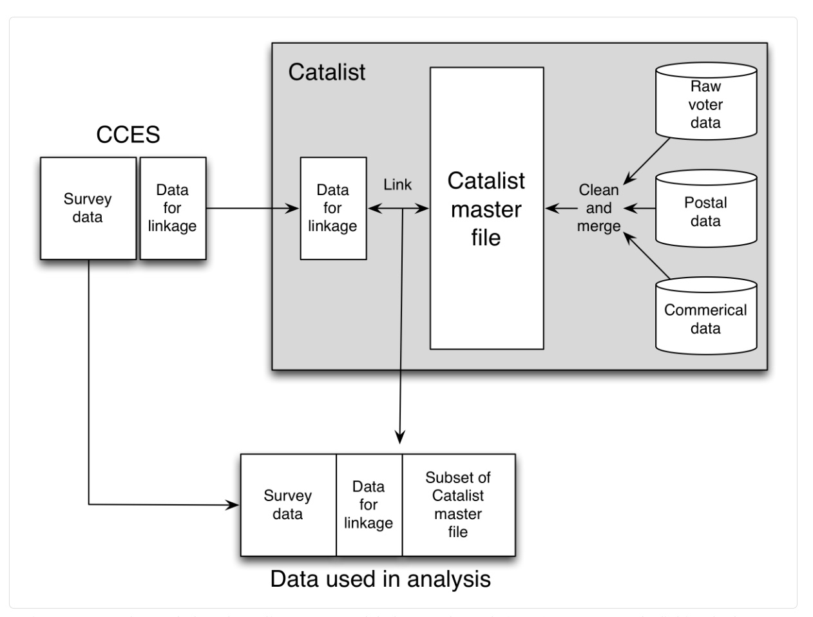

## Introduction 

>- We need surveys even in the digital age.
>- We need surveys ---even--- especially in the digital age.

>- Matthews Salganik

## Plan de présentation

- Introduction
- Évolution des enquêtes
- Caractéristiques des enquêtes à l'ère digitale

## Introduction

- Avec l'abondance des données digitales et digitalisées, on peut penser que nous n'avons plus besoin d'enquêtes

- La réponse est plutôt, à cause des données digitales, nous avons plus que besoin d'enquêtes

- Nous aurons besoin d'enquêtes pour les raisons suivantes:
  - les limites des données massives
  - (internal states vs. external states)
  - inaccessibilité des données massives

- La différence va être la manière de poser les questions qui va être différente

## Évolution des enquêtes

                   Échantillonnage      Interviews
------------------ -------------------- ----------------
Première période   Probabiliste         Face à face

## Évolution des enquêtes

                   Échantillonnage      Interviews
------------------ -------------------- ----------------
Première période   Probabiliste         Face à face
Deuxième période   Probabilité de       Téléphone
                   numérotation numé-
                   rique aléatoire

## Évolution des enquêtes

                   Échantillonnage      Interviews
------------------ -------------------- ----------------
Première période   Probabiliste         Face à face
Deuxième période   Probabilité de       Téléphone
                   numérotation numé-
                   rique aléatoire
Troisième période  Non probabiliste     Par ordinateur

## Évolution des enquêtes

                   Échantillonnage      Interviews      Environnement des données
------------------ -------------------- --------------- --------------------------
Première période   Probabiliste         Face à face     Autonome
Deuxième période   Probabilité de       Téléphone       Autonome
                   numérotation numé-
                   rique aléatoire
Troisième période  Non probabiliste     Par ordinateur  Lié

Erreurs
========================================

## Aperçu 1: 

- Biais et variance

## Aperçu 2:

https://academic.oup.com/poq/article/74/5/849/1817502

- Erreur totale = erreur de mesure + erreur de couverture

- Le cadre d'erreur totale d'enquête nous aide également à réfléchir à la façon dont l'ère numérique peut créer de nouvelles opportunités (à qui demander et comment demander)

Échantillonnage probabiliste et non probabiliste
==================================================

## Non probabiliste

                   Échantillonnage      Interviews      Environnement des données
------------------ -------------------- --------------- --------------------------
Première période   Probabiliste         Face à face     Autonome
Deuxième période   Probabilité de       Téléphone       Autonome
                   numérotation numé-
                   rique aléatoire
Troisième période  **Non probabiliste** Par ordinateur  Lié

## Échantillonnage probabiliste

- Échantillon probabiliste (approximativement) : chaque unité d'une population de base a une probabilité d'inclusion connue et non nulle

- Tous les échantillons probabilistes ne ressemblent pas à des versions miniatures de la population

- Mais, avec une pondération appropriée, les échantillons probabilistes peuvent produire des estimations non biaisées de la population de base

## Échantillonnage probabiliste

Principaux enseignements de l'échantillonnage probabiliste:
- La façon dont vous collectez vos données a un impact sur la façon dont vous faites des inférences
- Se concentre sur les propriétés des estimateurs et non sur les propriétés des échantillons

## Principe

$$ \hat{\bar y} = \frac{\sum y_i/\pi_i}{N} $$

$\pi_i$ : probabilité d'inclusion de l'individu i

encore appelé 

- estimateur Horvitz-Thompson
- estimateur $\pi_i$ 

## Inférence

- Echantillonnage probabiliste en théorie

                                répondants 
$\text{information connu sur l'échantillon} \Bigg\}$ estimateurs

- Echantillonnage probabiliste en pratique

                                  répondants 
$\text{information estimée sur l'échantillon} \Bigg\}$ estimateurs
Information auxilliaire + hypothèses

- Echantillonnage non-probabiliste

                                  répondants 
$\text{information connu sur l'échantillon} \Bigg\}$ estimateurs
Information auxilliaire + hypothèses

## Exemple

Imaginez que vous vouliez estimer la taille moyenne des étudiants de l'UQAM.

- Supposons que 50% sont des hommes et 50% sont des femmes
- Vous vous situez à l'extérieur de la Bibliothèque et recrutez un échantillon non aléatoire de 60 étudiants de l'UQAM
- Mâles (n= 20) : Taille moyenne : 180cm
- Femelles (n=40) : Taille moyenne : 170cm

Quelle est l'estimé de la taille moyenne?

## Exemple

- Moyenne de l'échantillon = 173.3 cm = $\frac{180*20 + 170*40}{20 + 40}$

- Moyenne pondérée = 175 cm = $(180*0.5 + 170*0.5)$

- L'estimation pondérée utilise des informations auxiliaires et des hypothèses 

- Comment cela pourrait-il mal tourner ?

<!-- La clé de la post-stratification est de former les bons groupes. Si vous pouvez découper la population en groupes homogènes de sorte que les propensions à répondre soient les mêmes pour tous les membres de chaque groupe, la post-stratification produira des estimations non biaisées. En d'autres termes, la post-stratification par sexe produira des estimations non biaisées si tous les hommes ont la propension à répondre et si toutes les femmes ont la même propension à répondre. Cette hypothèse est appelée l'hypothèse homogène-réponse-propensions-à- l'intérieur des groupes , et je la décris un peu plus dans les notes mathématiques à la fin de ce chapitre.-->

## Conclusion

## Conclusion

## Conclusion

- Les échantillons n'ont pas besoin de ressembler à des mini-populations
- La clé pour faire de bonnes estimations est que le processus d'estimation prenne en compte le processus d'échantillonnage
- Il n'y a pas de différence nette entre l'échantillonnage probabiliste en pratique et l'échantillonnage non probabiliste
- Pour en savoir plus : Lohr(2009) ou Sandal et al.(2013)

<!--Il y a deux leçons principales de l'étude de Wang et de ses collègues. Premièrement, les échantillons non probabilistes non ajustés peuvent conduire à de mauvaises estimations; C'est une leçon que de nombreux chercheurs ont déjà entendue. La deuxième leçon, cependant, est que les échantillons non probabilistes, lorsqu'ils sont analysés correctement, peuvent effectivement produire de bonnes estimations; les échantillons non probabilistes ne doivent pas automatiquement conduire à quelque chose comme le fiasco Literary Digest .-->

Enquêtes administrées par les machines
=========================================

## Administré par ordinateur

                   Échantillonnage      Interviews         Environnement des données
------------------ -------------------- ------------------ --------------------------
Première période   Probabiliste         Face à face        Autonome
Deuxième période   Probabilité de       Téléphone          Autonome
                   numérotation numé-
                   rique aléatoire
Troisième période  Non probabiliste     **Par ordinateur** Lié

<!--Une étude de Michael Schober et ses collègues (2015) illustre les avantages de l'ajustement des approches traditionnelles pour mieux correspondre aux systèmes de communication numériques. Dans cette étude, Schober et ses collègues ont comparé différentes approches pour poser des questions aux gens via un téléphone mobile. Ils ont comparé la collecte de données via des conversations vocales, ce qui aurait été une traduction naturelle des approches de la deuxième ère, à la collecte de données via de nombreuses microsurveys envoyées par SMS, une approche sans précédent évident. Ils ont découvert que les microsurveys envoyés par texto conduisaient à des données de meilleure qualité que les interviews vocales. En d'autres termes, le simple transfert de l'ancienne approche dans le nouveau support n'a pas conduit à des données de la plus haute qualité. Au lieu de cela, en pensant clairement aux capacités et aux normes sociales autour des téléphones mobiles, Schober et ses collègues ont pu développer une meilleure façon de poser des questions qui mènent à des réponses de meilleure qualité.-->

## Administré par ordinateur

- Opportunités
    - réduire le biais de désirabilité sociale: la tendance des répondants à essayer de se présenter de la meilleure façon possible
    - éliminer les effets de l'intervieweur : la tendance des réponses à être influencée de façon subtile par les caractéristiques de l'intervieweur humain
    - Réduction des coûts : temps et argent
    - Augmente la flexibilité pour les répondants
    
## Administré par ordinateur

- Défis
    - Réduire les taux de non-réponses
    - Clarifier les questions confuses
    - Maintenir l'engagement des répondants

<!--En termes d'avantages, retirer les intervieweurs humains peut réduire le biais de désirabilité sociale , la tendance des répondants à essayer de se présenter de la meilleure façon possible, par exemple, sous-déclaration des comportements stigmatisés (p. comportement (p. ex. vote) (Kreuter, Presser, and Tourangeau 2008) . L'élimination des intervieweurs humains peut également éliminer les effets de l'intervieweur , la tendance des réponses à être influencée de façon subtile par les caractéristiques de l'intervieweur humain (West and Blom 2016) . En plus d'améliorer la précision pour certains types de questions, la suppression des intervieweurs humains réduit considérablement les coûts - le temps d'entrevue est l'une des dépenses les plus importantes dans la recherche par sondage - et augmente la flexibilité parce que les répondants peuvent participer quand ils le veulent. . Cependant, supprimer l'intervieweur humain crée également des défis. En particulier, les enquêteurs peuvent établir un rapport avec les répondants qui peut augmenter les taux de participation, clarifier des questions confuses et maintenir l'engagement des répondants pendant qu'ils parcourent un questionnaire long (potentiellement fastidieux) (Garbarski, Schaeffer, and Dykema 2016) . Ainsi, passer d'un mode d'enquête administré par un intervieweur à un mode administré par ordinateur crée des opportunités et des défis.-->

Combiner les enquêtes avec les données massives
=================================================

## Lié

                   Échantillonnage      Interviews         Environnement des données
------------------ -------------------- ------------------ --------------------------
Première période   Probabiliste         Face à face        Autonome
Deuxième période   Probabilité de       Téléphone          Autonome
                   numérotation numé-
                   rique aléatoire
Troisième période  Non probabiliste     Par ordinateur     **Lié**

## Deux perspectives

## cas 1:

[Ansolabehere and Hersh (2012)](https://www.jstor.org/stable/23359641)

## cas 1:

[Ansolabehere and Hersh (2012)](https://www.jstor.org/stable/23359641)

<!--Figure 3.13: Schéma de l'étude réalisée par Ansolabehere and Hersh (2012) . Pour créer le fichier de données maître, Catalist combine et harmonise les informations de nombreuses sources différentes. Ce processus de fusion, peu importe la prudence, propage les erreurs dans les sources de données d'origine et introduit de nouvelles erreurs. Une deuxième source d'erreurs est le couplage d'enregistrements entre les données d'enquête et le fichier de données maître. Si chaque personne avait un identifiant unique et stable dans les deux sources de données, alors le couplage serait trivial. Mais, Catalist a dû faire le lien en utilisant des identifiants imparfaits, dans ce cas, le nom, le sexe, l'année de naissance, et l'adresse du domicile. Malheureusement, dans de nombreux cas, il peut y avoir des informations incomplètes ou inexactes; un électeur nommé Homer Simpson pourrait apparaître comme Homer Jay Simpson, Homie J Simpson, ou même Homer Sampsin. Malgré le potentiel d'erreurs dans le fichier de données maître Catalyst et les erreurs dans le couplage d'enregistrements, Ansolabehere et Hersh ont pu établir la confiance dans leurs estimations grâce à différents types de contrôles -->

## Cas 2: 

[Blumenstock, Cadamuro, and On (2015)](https://science.sciencemag.org/content/350/6264/1073)

## Prédire la pauvreté}

- Contexte: La répartition géographique de la pauvreté et de la richesse est utilisée pour prendre des décisions sur l'allocation des ressources et fournit une base pour l'étude des inégalités et des déterminants de la croissance économique.
  - Problèmes en ASS: Enquête clairsemée sur la pauvreté 

## Prédire la pauvreté}

L'étude combine des données volumineuses (Big Data) avec des données d'enquête
  - Big data: base de données contenant des enregistrements de milliards d’interactions sur le plus grand réseau de téléphonie mobile du Rwanda auprès de 1,5 million d’individus uniques
  - Enquête: enquêtes téléphoniques de suivi d'un échantillon aléatoire stratifié géographiquement de 856 abonnés individuels 
  - Les données de téléphonie mobile sont utilisées par de plus en plus de personnes en Afrique subsaharienne
  - Téléphones portables peuvent:
    - Capturer des informations riches sur la fréquence et le calendrier des événements de communication
    - Refléter la structure complexe du réseau social d’un individu
    - Révéler le modèle de choix de lieu de voyage et
    - Histoires de consommation et dépenses

## Prédire la pauvreté}

## Prédire la pauvreté}

 

## Prédire la pauvreté}

## Prédire la pauvreté}

- Les estimations de Blumenstock et de ses collègues étaient environ 10 fois plus rapides et 50 fois moins chères (lorsque le coût est mesuré en termes de coûts variables)
- Cette recette ne contient que deux ingrédients et deux étapes. Les ingrédients sont:
  - Une source de données volumineuse qui est large mais mince (c’est-à-dire qu’elle a beaucoup de personnes mais pas les informations dont vous avez besoin sur chaque personne) et 
 - Une enquête étroite mais dense (c’est-à-dire qu’elle n’a que quelques personnes, mais qu’elle a les informations dont vous avez besoin sur ces personnes)

## Conclusion

- Les sondages et les mégadonnées sont des compléments et non des substituts
- Parfois on fait des "demandes enrichies" et parfois des demandes "amplifiées" (le rôle de la source de big data est di érent dans les deux cas)
- Ressources : [chapitre 3 de bit by bit](https://www.bitbybitbook.com/en/1st-ed/asking-questions/)

## Références

[Galesic et al. Asking about social circles improves election predictions](https://www.nature.com/articles/s41562-018-0302-y)

